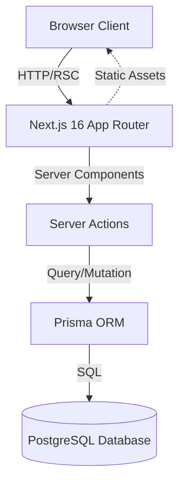
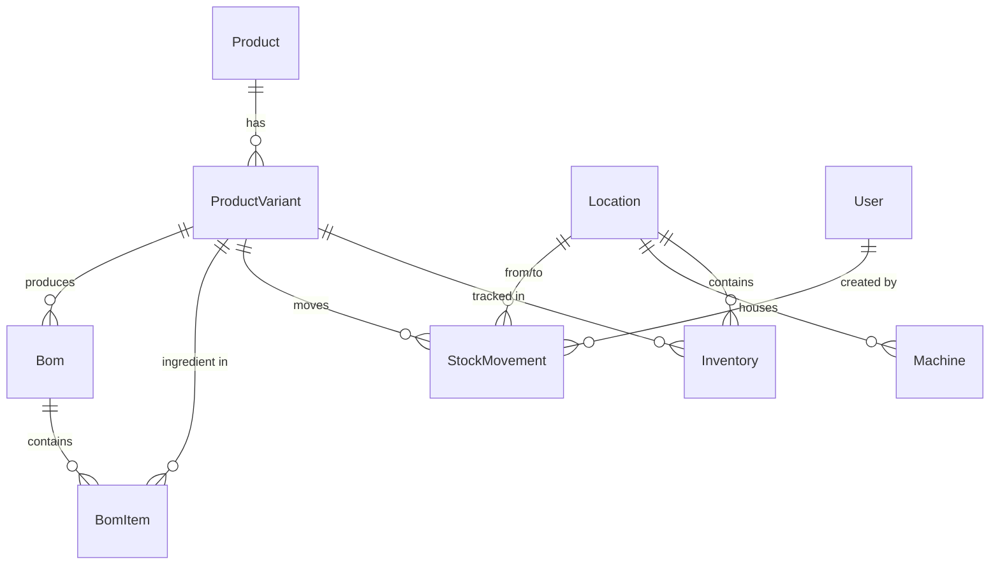
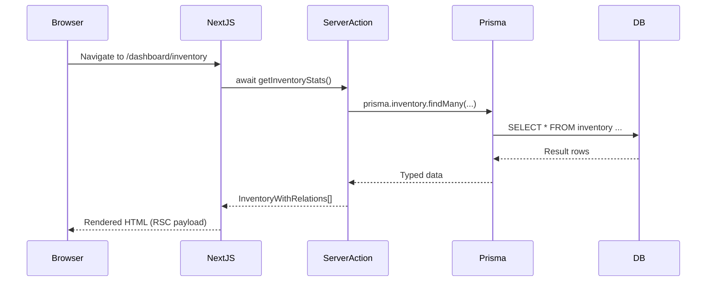
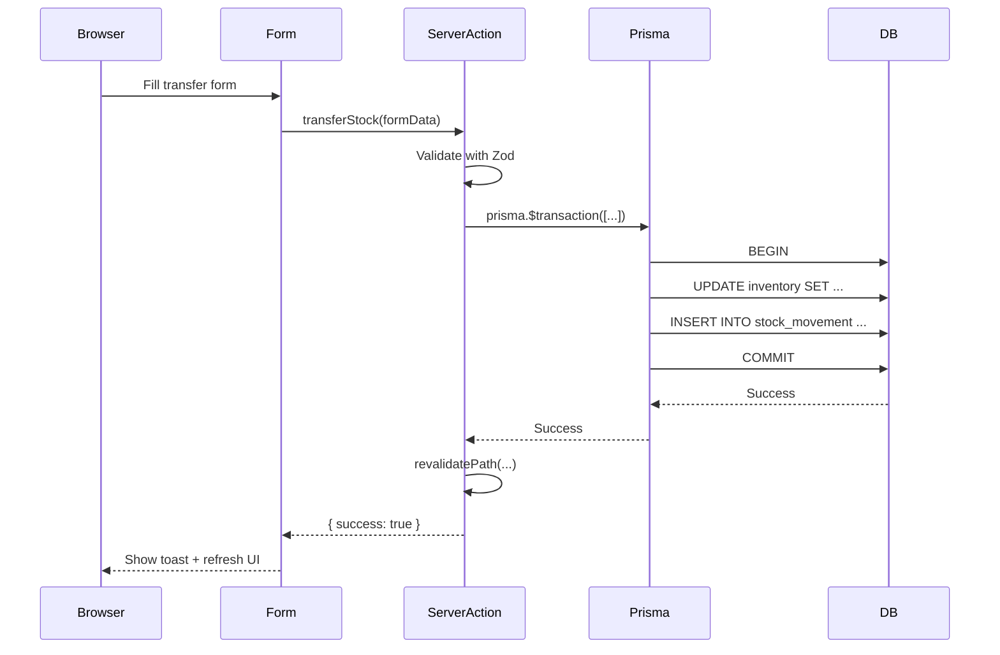
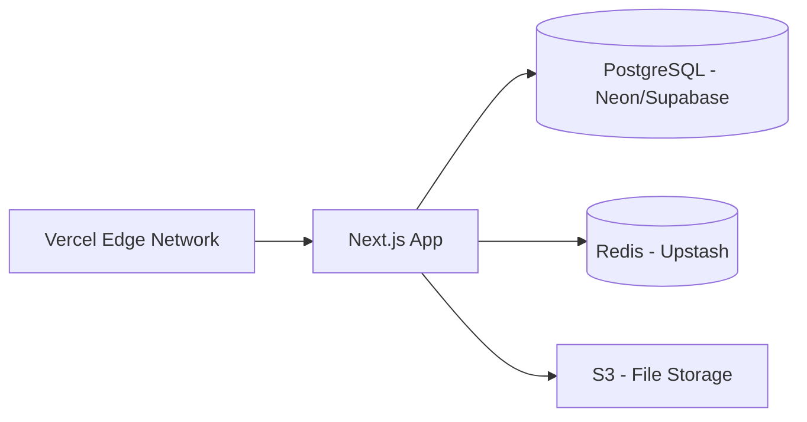

# PolyFlow System Architecture

## 🏗️ Architecture Overview

PolyFlow follows a **modern full-stack architecture** using Next.js 16 with the App Router, leveraging server-side rendering (SSR), Server Actions, and server-side data fetching for optimal performance and developer experience.



---

## 📐 Application Layers

### 1. **Presentation Layer** (Client Components + Server Components)

**Directory**: `/src/app/*`, `/src/components/*`

**Technologies**:
- React 19.2.3 (Server Components + Client Components)
- TailwindCSS v4 (Utility-first styling)
- Radix UI (Accessible component primitives)
- Lucide React (Icons)

**Key Patterns**:
- **Server Components by default** - Reduced client-side JavaScript
- **Client Components** (`"use client"`) only when needed:
  - Forms with interactivity
  - State management (useState, useContext)
  - Browser APIs (localStorage, etc.)
- **File-based routing** via Next.js App Router

**Example Structure**:
```
/src/app/dashboard/
  ├── page.tsx              # Server Component (Dashboard)
  ├── layout.tsx            # Shared layout with navigation
  ├── products/
  │   ├── page.tsx          # Product list (Server)
  │   ├── create/
  │   │   └── page.tsx      # Create form (Client)
  │   └── [id]/
  │       └── edit/
  │           └── page.tsx  # Edit form (Client)
  ├── inventory/
  │   ├── page.tsx          # Inventory dashboard (Server)
  │   ├── transfer/
  │   │   └── page.tsx      # Transfer form (Client)
  │   └── adjustment/
  │       └── page.tsx      # Adjustment form (Client)
  ├── production/
  │   └── page.tsx          # Production dashboard
  ├── kiosk/                # OPERATOR INTERFACE (Top-level)
  │   └── page.tsx          # Touch-friendly simplified UI
  └── warehouse/            # WAREHOUSE PORTAL (Top-level)
      └── page.tsx          # Material fulfillment interface
```

---

### 2. **Application Logic Layer** (Server Actions)

**Directory**: `/src/actions/*`

**Technologies**:
- Next.js Server Actions
- Zod (Runtime validation)
- Prisma Client

**Key Files**:
- `inventory.ts` - Stock operations (transfer, adjustment, stats)
- `product.ts` - Product CRUD operations

**Pattern**:
```typescript
'use server';

export async function transferStock(data: TransferStockValues) {
  // 1. Validation
  const result = transferStockSchema.safeParse(data);
  if (!result.success) {
    return { success: false, error: result.error.issues[0].message };
  }

  // 2. Business logic + Database transaction
  try {
    await prisma.$transaction(async (tx) => {
      // ... atomic operations
    });

    // 3. Cache invalidation
    revalidatePath('/dashboard/inventory');
    
    return { success: true };
  } catch (error) {
    return { success: false, error: error.message };
  }
}
```

**Benefits**:
- Type-safe server-client communication
- Automatic API route generation
- No need for separate API layer
- Built-in CSRF protection

---

### 3. **Data Access Layer** (Prisma ORM)

**Directory**: `/prisma/*`, `/src/lib/prisma.ts`

**Key Files**:
- `schema.prisma` - Database schema definition
- `seed.ts` - Initial data seeding
- `prisma.ts` - Prisma Client singleton

**Singleton Pattern** (`/src/lib/prisma.ts`):
```typescript
import { PrismaClient } from '@prisma/client';

const globalForPrisma = global as unknown as { prisma: PrismaClient };

export const prisma =
  globalForPrisma.prisma ||
  new PrismaClient({
    log: ['query', 'error', 'warn'],
  });

if (process.env.NODE_ENV !== 'production') globalForPrisma.prisma = prisma;
```

**Benefits**:
- Prevents multiple Prisma Client instances in dev mode
- Type-safe database queries
- Auto-generated TypeScript types

---

### 4. **Database Layer** (PostgreSQL)

**Schema**: See `/prisma/schema.prisma`

**Key Models**:


**Data Integrity Constraints**:
- Unique constraints: `skuCode`, `location-variant composite key`
- Foreign key cascades on delete (BOM → BomItem)
- Decimal types for precision (money, quantities)
- Indexes on frequently queried fields

---

## 🔄 Data Flow Architecture

### Read Flow (Server Components)



**Benefits**:
- No client-side JavaScript for data fetching
- Automatic request deduplication
- Streaming SSR for fast TTFB

---

### Write Flow (Server Actions)



**Key Points**:
- All validation on server (Zod schemas)
- Transactions ensure atomicity
- Automatic UI refresh via `revalidatePath()`

---

## 🧩 Component Architecture

### Component Hierarchy

```
app/dashboard/page.tsx (Server Component)
├── StatCard (Server Component)
│   └── Card (shadcn/ui)
│       ├── CardHeader
│       └── CardContent
└── ActionCard (Server Component)
    └── Card (shadcn/ui)

app/dashboard/inventory/transfer/page.tsx (Server Component)
└── TransferForm (Client Component)
    ├── Form (react-hook-form)
    ├── Select (Radix UI)
    ├── Input (shadcn/ui)
    └── Button (shadcn/ui)
```

### Reusable UI Components (`/src/components/ui/*`)

**shadcn/ui Pattern**:
- Copy-paste components (not npm package)
- Built on Radix UI primitives
- Fully customizable
- TailwindCSS styling

**Key Components**:
- `button.tsx` - Button with variants
- `card.tsx` - Card container
- `dialog.tsx` - Modal dialogs
- `form.tsx` - Form wrapper (react-hook-form)
- `input.tsx` - Text input
- `select.tsx` - Dropdown select
- `table.tsx` - Data table
- `tooltip.tsx` - Tooltips
- `sonner.tsx` - Toast notifications

---

## 🔐 Security Architecture

### Current Implementation

**Server-Side Validation**:
- ✅ All inputs validated with Zod before database operations
- ✅ Server Actions prevent direct client-to-database access
- ✅ SQL injection prevention via Prisma parameterized queries

**Missing (Planned)**:
- ❌ Authentication (no login required yet)
- ❌ Authorization (no role-based access control)
- ❌ CSRF tokens (Next.js Server Actions provide built-in protection)
- ❌ Rate limiting
- ❌ Input sanitization for XSS

**Recommendation**: Implement NextAuth.js or Clerk in Phase 1 (see IMPROVEMENTS.md)

---

## 📊 State Management

### Current Approach

**No Global State Management Library**

PolyFlow intentionally avoids Redux/Zustand/Recoil because:
- Server Components fetch data server-side (no client state needed)
- Forms use `react-hook-form` for local state
- Server Actions + `revalidatePath()` handle mutations

**State Patterns**:
1. **Server State**: Fetched in Server Components, passed as props
2. **Form State**: Managed by `react-hook-form`
3. **UI State**: Local `useState` in Client Components (dialogs, dropdowns)
4. **URL State**: Search params for filters (`?locationId=xyz`)

---

## 🚀 Performance Optimizations

### Current Optimizations

1. **Server Components** - Reduced client bundle size
2. **Route Prefetching** - Next.js Link components
3. **Image Optimization** - (not currently used, but available via next/image)
4. **Font Optimization** - next/font for Geist font

### Recommended Additions (from IMPROVEMENTS.md)

1. **Pagination** - Cursor-based for large tables
2. **Virtual Scrolling** - For 1000+ row tables
3. **Database Indexes** - On `locationId`, `productVariantId`, `skuCode`
4. **Redis Caching** - For locations, product types (static data)
5. **React Query** - For client-side caching (if needed)

---

## 🧪 Testing Strategy (Planned)

### Recommended Test Pyramid

```
        /\
       /  \  E2E Tests (10%)
      /    \  - Playwright
     /------\  - Critical user flows
    /        \
   /  Integ.  \ Integration Tests (30%)
  /   Tests    \  - Server Actions + Database
 /              \  - Prisma transactions
/----------------\
   Unit Tests (60%)
   - Pure functions
   - Zod schemas
   - Utility functions
```

**Tools**:
- **Vitest** - Unit + integration tests
- **Playwright** - E2E tests
- **Testing Library** - React component tests
- **MSW** - API mocking

---

## 📦 Deployment Architecture

### Current Setup

**Development**:
- Local PostgreSQL database
- `npm run dev` on port 3000

**Recommended Production Setup**:



**Provider Recommendations**:
- **Hosting**: Vercel (optimized for Next.js)
- **Database**: Neon, Supabase, or AWS RDS
- **Caching**: Upstash Redis or AWS ElastiCache
- **File Storage**: AWS S3 or Cloudflare R2
- **CDN**: Cloudflare or built-in Vercel CDN

**Environment Variables**:
```env
DATABASE_URL=postgresql://...
REDIS_URL=redis://...
AWS_S3_BUCKET=...
NEXTAUTH_SECRET=...
NEXTAUTH_URL=https://polyflow.app
```

---

## 🔧 Development Workflow

### Local Development Setup

1. **Install dependencies**:
   ```bash
   npm install
   ```

2. **Set up database**:
   ```bash
  npx prisma@5.22.0 migrate dev
  npx prisma@5.22.0 db seed
   ```

3. **Run dev server**:
   ```bash
   npm run dev
   ```

4. **Generate Prisma Client** (after schema changes):
   ```bash
  npx prisma@5.22.0 generate
   ```

5. **Create migration** (after schema changes):
   ```bash
  npx prisma@5.22.0 migrate dev --name add_batch_tracking
   ```

### Code Quality Tools

**Current**:
- ESLint (Next.js config)
- TypeScript strict mode

**Recommended Additions**:
- Prettier (code formatting)
- Husky (pre-commit hooks)
- lint-staged (lint only changed files)
- Commitlint (conventional commits)

---

## 📁 File Structure Conventions

```
polyflow/
├── prisma/
│   ├── schema.prisma          # Single source of truth for data model
│   ├── seed.ts                # Initial data
│   └── migrations/            # Version-controlled schema changes
├── public/
│   ├── favicon.ico
│   └── images/
├── src/
│   ├── app/                   # Next.js App Router pages
│   │   ├── layout.tsx         # Root layout
│   │   ├── page.tsx           # Landing page
│   │   └── dashboard/
│   │       ├── layout.tsx     # Dashboard layout with nav
│   │       ├── page.tsx       # Dashboard home
│   │       ├── products/
│   │       ├── inventory/
│   │       └── settings/
│   ├── components/
│   │   ├── ui/                # shadcn/ui components
│   │   ├── inventory/         # Domain-specific components
│   │   └── products/
│   ├── actions/               # Server Actions
│   │   ├── inventory.ts
│   │   └── product.ts
│   ├── lib/
│   │   ├── prisma.ts          # Prisma Client singleton
│   │   ├── zod-schemas.ts     # Validation schemas
│   │   └── utils.ts           # Utility functions
│   └── types/                 # Shared TypeScript types
├── .env                       # Environment variables (gitignored)
├── package.json
├── tsconfig.json
├── next.config.ts
└── tailwind.config.ts
```

**Naming Conventions**:
- Components: PascalCase (`ProductForm.tsx`)
- Server Actions: camelCase (`getProducts`, `createProduct`)
- Files: kebab-case for routes (`stock-adjustment/`)
- Database models: PascalCase singular (`Product`, `StockMovement`)

---

## 🔄 Migration Strategy (Schema Changes)

### Prisma Migrate Workflow

1. **Modify schema**: Edit `prisma/schema.prisma`
2. **Create migration**:
   ```bash
  npx prisma@5.22.0 migrate dev --name add_batch_model
   ```
3. **Review SQL**: Check `prisma/migrations/<timestamp>_add_batch_model/migration.sql`
4. **Apply to production**:
   ```bash
  npx prisma@5.22.0 migrate deploy
   ```

**Important**:
- Never delete migrations folder
- Always test migrations on staging before production
- Use `prisma migrate diff` to preview changes
- Backup database before major migrations

---

## 💡 Architectural Decisions

### Why Server Components?

**Pros**:
- Zero client-side JavaScript for data fetching
- Direct database access (no API layer needed)
- Improved performance (no waterfall requests)
- SEO-friendly (fully rendered HTML)

**Cons**:
- Learning curve (new mental model)
- Cannot use browser APIs directly
- Requires careful client/server boundary management

### Why Prisma over TypeORM/Sequelize?

**Pros**:
- Auto-generated TypeScript types
- Type-safe queries (no runtime errors)
- Excellent developer experience
- Migrations built-in
- Active community and development

**Cons**:
- Not as mature as TypeORM for complex queries
- Less flexible for raw SQL (but supports it)
- Vendor lock-in to Prisma schema format

### Why Server Actions over API Routes?

**Pros**:
- Less boilerplate (no need to create `/api/*` routes)
- Type safety from client to server
- Built-in CSRF protection
- Progressive enhancement

**Cons**:
- Relatively new (Next.js 13+)
- Less control over HTTP response
- Cannot be called from external clients (mobile apps)

**Recommendation**: Use Server Actions for internal operations, create API routes if external API access is needed.

---

## 🚀 Scalability Considerations

### Current Limits

- **Database**: PostgreSQL can handle millions of rows (no scaling issues expected for typical ERP)
- **Concurrency**: Next.js scales horizontally (add more Vercel instances)
- **File Storage**: Not implemented yet (will need S3 for documents/images)

### When to Scale

**Indicators**:
- Database query time > 1 second
- API response time > 500ms
- Concurrent users > 1000

**Scaling Strategies**:
1. **Read Replicas** - Offload read-heavy queries
2. **Caching Layer** - Redis for hot data
3. **CDN** - Static assets and API responses
4. **Database Sharding** - By location or date range (last resort)

---

**Last Updated**: January 22, 2026
