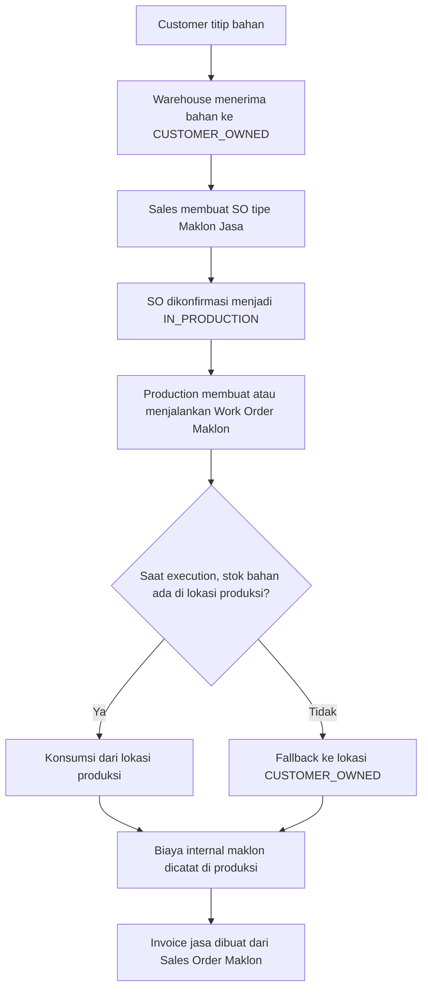

# Maklon Sales Flow

Dokumen ini merangkum alur operasional untuk order `Maklon Jasa` di PolyFlow, dengan fokus pada pertanyaan utama: apakah barang maklon dikeluarkan dari Sales Order seperti shipment biasa.

Jawaban singkat: tidak. Sales Order maklon dipakai untuk order jasa dan invoicing, sedangkan konsumsi bahan titipan terjadi saat execution produksi.

## Ringkasan

- `MAKE_TO_STOCK` mengambil barang dari stok jadi yang tersedia.
- `MAKE_TO_ORDER` masuk ke jalur produksi jika stok tidak mencukupi.
- `MAKLON_JASA` adalah flow jasa berbasis produksi; bahan titipan customer tidak keluar dari sales, tetapi dikonsumsi saat work order berjalan.

## SOP Singkat

1. Siapkan lokasi bertipe `CUSTOMER_OWNED` untuk bahan titipan customer.
2. Terima bahan titipan lewat flow receive maklon ke lokasi tersebut.
3. Buat Sales Order dengan tipe `Maklon Jasa`.
4. Isi customer wajib, lalu gunakan item bertipe service, bukan barang fisik.
5. Confirm Sales Order sampai status menjadi `IN_PRODUCTION`.
6. Buat dan jalankan Production Order atau Work Order maklon.
7. Biarkan sistem mengonsumsi bahan titipan saat production execution.
8. Buat invoice dari Sales Order karena yang ditagihkan adalah jasa maklon.

## Mekanisme Pengeluaran Barang Maklon

Barang maklon tidak dikeluarkan melalui shipment Sales Order biasa.

Saat execution produksi berjalan, sistem menentukan sumber bahan dengan urutan berikut:

1. Ambil dari lokasi produksi lebih dulu jika stok sudah ada di sana.
2. Jika stok tidak ada di lokasi produksi, fallback ke lokasi `CUSTOMER_OWNED`.

Implikasi operasionalnya:

- Tim sales tidak perlu membuat issue barang maklon manual dari Sales Order.
- Tim warehouse dan production mengelola perpindahan fisik bahan titipan.
- Jejak konsumsi bahan tercatat di movement dan material issue produksi.

## Aturan Sistem Saat Ini

- Sales Order `Maklon Jasa` hanya boleh berisi item service.
- Confirm Sales Order `Maklon Jasa` mengubah status order menjadi `IN_PRODUCTION`.
- Work order maklon harus ditandai sebagai order produksi maklon.
- Movement maklon diperlakukan off-balance sheet dan tidak mengikuti valuasi inventory normal milik perusahaan.

## Diagram

## Kesimpulan Praktis

Untuk user operasional:

- Anggap maklon sebagai flow berbasis produksi, bukan shipment sales biasa.
- Sales Order maklon dipakai untuk demand jasa dan invoice.
- Pengeluaran bahan titipan terjadi saat execution produksi, bukan saat confirm atau ship Sales Order.

Jika ada stok maklon lama yang masih tersimpan di lokasi non-maklon, gunakan [Maklon Stock Repair Runbook](./MAKLON_STOCK_REPAIR.md).