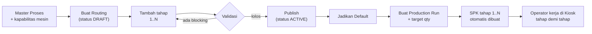

# Panduan Routing Produksi (untuk Admin & Operator)

Dokumen ini menjelaskan cara pakai fitur **Routing Produksi** di PolyFlow: dari
menyiapkan master proses, menyusun routing, sampai menjalankan Production Run di
lantai produksi. Ditulis untuk admin/planner dan operator yang baru pertama kali
memakainya.

Kalau hanya butuh satu hal: **routing = urutan tahap produksi untuk satu produk
jadi. Satu Production Run = satu klik yang otomatis membuat SPK untuk semua
tahap sekaligus, sudah lengkap dengan jumlah bahan tiap tahap.**

---

## 1. Kapan pakai routing, kapan tidak

| Kondisi produk                                                                    | Pakai apa                                    |
| --------------------------------------------------------------------------------- | -------------------------------------------- |
| Sekali proses langsung jadi (1 BoM, 1 SPK)                                        | **Tidak perlu routing.** SPK manual dari BoM |
| Berantai: Mixing → Extrusion → Packing (output tahap jadi bahan tahap berikutnya) | **Routing + Production Run**                 |
| Berantai tapi cuma sekali seumur hidup (produk sampel)                            | SPK manual saja, jangan bikin routing        |

Routing tidak menggantikan BoM. Routing **memakai** BoM: setiap tahap menunjuk
satu BoM. Tanpa BoM, routing tidak bisa dibuat.

---

## 2. Lima istilah yang harus dibedakan

| Istilah                    | Artinya                                                                 | Contoh                                    |
| -------------------------- | ----------------------------------------------------------------------- | ----------------------------------------- |
| **Proses** (Process)       | Master jenis pekerjaan. Dipakai ulang oleh semua produk.                | `MIXING`, `EXTRUSION`, `CARTON_PACKING`   |
| **Routing** (Route)        | Urutan tahap untuk **satu varian produk jadi**. Punya versi & status.   | "Sedotan Bening 6mm v1"                   |
| **Tahap** (Route Step)     | Satu baris di routing: Proses + BoM + lokasi ambil bahan + lokasi hasil | Tahap 2 = `EXTRUSION` + BoM Sedotan Curah |
| **Run** (Production Run)   | Satu perintah produksi nyata dari sebuah routing + target jumlah.       | `RUN-260808-A1B2`, target 1.000 pack      |
| **SPK** (Production Order) | Surat perintah kerja per tahap. Dibuat otomatis oleh Run.               | 3 tahap → 3 SPK dalam satu Run            |

Analogi: **Proses** = daftar jenis pekerjaan di pabrik. **Routing** = resep
urutan kerja. **Run** = pesanan "buat 1.000 pack hari ini". **SPK** = kertas
kerja yang dipegang operator tiap tahap.

---

## 3. Alur besar



---

## 4. Prasyarat sebelum bisa dipakai

### 4.1 Fitur harus dinyalakan (dua saklar, dua-duanya wajib ON)

1. **Saklar server** — env `ROUTING_ENABLED=true`. Ini diatur admin infra saat
   deploy, bukan dari dalam aplikasi.
2. **Saklar tenant** — _Pengaturan → tab **Kiosk Produksi** → kartu "Fitur
   Routing Produksi" → aktifkan → Simpan_. Hanya ADMIN yang melihat tab ini.

Kalau saklar server masih OFF, kartu pengaturan akan menampilkan peringatan
kuning. Menyalakan toggle tenant saja **tidak cukup** — semua aksi routing akan
ditolak dengan pesan _"Fitur routing belum diaktifkan untuk tenant ini."_

### 4.2 Hak akses

| Aksi                                               | Role yang boleh             |
| -------------------------------------------------- | --------------------------- |
| Lihat routing / proses / run                       | PLANNING, ADMIN             |
| Buat & ubah proses, routing, tahap; publish; arsip | PLANNING, ADMIN             |
| Buat Production Run                                | PLANNING, ADMIN             |
| Buat SPK dari Papan Permintaan (otomatis jadi Run) | PRODUCTION, PLANNING, ADMIN |
| Kerja di Kiosk (mulai/stop, catat hasil)           | Operator produksi           |

### 4.3 Data yang harus sudah ada

- **BoM aktif** untuk setiap tahap, termasuk BoM WIP/antara (bukan hanya BoM produk jadi).
- **Lokasi gudang** untuk hasil tiap tahap (wajib) dan sumber bahan (opsional).
- **Mesin** beserta kapabilitas proses, untuk proses yang bertanda "butuh mesin".

---

## 5. Di mana menunya

| Halaman               | Jalur menu                                  | URL                              |
| --------------------- | ------------------------------------------- | -------------------------------- |
| Daftar routing        | Produksi → **Resep** → Routing Produksi     | `/production/routings`           |
| Master proses         | Tombol **Kelola Proses** di halaman routing | `/production/routings/processes` |
| Daftar Production Run | Produksi → **Antrean** → Production Runs    | `/production/runs`               |
| Papan permintaan FG   | Produksi → **Antrean** → Permintaan Masuk   | `/production/requests`           |
| SPK                   | Produksi → **Antrean** → Perintah Kerja     | `/production/orders`             |

> Catatan: di halaman Production Run yang masih kosong ada tombol "Papan
> Permintaan" yang mengarah ke `/production/demand-board` — halaman itu tidak
> ada (404). Pakai menu **Permintaan Masuk** (`/production/requests`).

---

## 6. Langkah A — siapkan master proses (sekali saja per pabrik)

Buka **Kelola Proses**. Baseline yang biasanya sudah tersedia:

`MIXING`, `EXTRUSION`, `INJECTION`, `WINDING`, `TRIMMING`, `INNER_PACKING`,
`STERILIZATION`, `CARTON_PACKING`, `PACKING`, `REWORK`, `STANDARD`.

Kalau belum ada, admin/dev bisa mengisinya sekaligus dengan skrip:

```bash
npx tsx scripts/seed-production-processes.ts --preview          # lihat dulu, tidak menulis
npx tsx scripts/seed-production-processes.ts --apply --confirm  # baru menulis
```

Skrip ini juga memetakan mesin yang sudah ada ke proses sesuai tipe mesinnya.

### Isi form proses baru

| Field                | Aturan                                                                 |
| -------------------- | ---------------------------------------------------------------------- |
| **Code**             | HURUF BESAR, angka, underscore. 2–30 karakter. Contoh: `STERILIZATION` |
| **Name**             | Nama manusiawi. Contoh: "Sterilisasi Produk"                           |
| **Requires Machine** | Centang kalau tahap ini wajib pakai mesin                              |
| **QC Gate**          | Centang kalau tahap berikutnya baru boleh jalan setelah QC lulus       |
| **Execution Mode**   | Cara kiosk mencatat hasil (lihat di bawah)                             |

**Execution Mode:**

- `GENERIC` — kiosk normal, hasil dicatat per SPK. Pilihan default.
- `INDIVIDUAL_OUTPUT` — hasil melekat ke operator masing-masing (borongan per orang).
- `MATERIAL_CONVERSION` — kiosk menampilkan preview konsumsi WIP dari BoM.

### Kapabilitas mesin (penting!)

Proses yang dicentang **Requires Machine** tidak bisa dipublish routing-nya
kalau belum ada satu pun mesin yang terdaftar mampu mengerjakannya
(error `ROUTE_NO_CAPABLE_MACHINE`).

Tambahkan lewat kartu **Machine Capability** di bawah halaman Kelola Proses.
Form ini masih meminta **Machine ID** dan **Process ID** berupa UUID — salin
dari URL halaman mesin, atau jalankan skrip seed di atas yang memetakan otomatis
berdasarkan tipe mesin:

| Proses           | Tipe mesin yang cocok (fallback bawaan) |
| ---------------- | --------------------------------------- |
| `MIXING`         | MIXER                                   |
| `EXTRUSION`      | EXTRUDER, REWINDER                      |
| `WINDING`        | REWINDER                                |
| `INJECTION`      | EXTRUDER                                |
| `TRIMMING`       | GRANULATOR                              |
| `INNER_PACKING`  | PACKER                                  |
| `CARTON_PACKING` | PACKER, GRANULATOR                      |
| `STERILIZATION`  | — (manual, tidak butuh mesin)           |

---

## 7. Langkah B — buat routing baru

1. Buka **Routing Produksi** → **Buat Routing Baru**.
2. Pilih **Produk Akhir / WIP**. Tab "Punya BoM" hanya menampilkan varian yang
   sudah punya BoM aktif — pakai tab ini. Kalau kosong, buat BoM dulu.
3. Nama routing otomatis disarankan (mis. "Sedotan Bening 6mm v1"), boleh diubah.
4. **Simpan Draft**.

Routing baru selalu berstatus **DRAFT** dan **tidak bisa langsung jadi default**.

---

## 8. Langkah C — isi tahapnya

Buka routing → panel kanan **Tambah Tahap**. Isi per tahap:

| Field                      | Penjelasan                                                                 |
| -------------------------- | -------------------------------------------------------------------------- |
| **Kode Tahap**             | HURUF BESAR/angka/underscore, unik dalam routing. Contoh: `MIX`, `EXTRUDE` |
| **Nama Tahap**             | Bebas. Contoh: "Extrusi Sedotan Curah"                                     |
| **Proses**                 | Ambil dari master proses                                                   |
| **BoM**                    | BoM yang **output-nya = hasil tahap ini** (boleh WIP)                      |
| **Ambil bahan dari**       | Opsional. Kosong = ikut lokasi output tahap sebelumnya (lihat catatan)     |
| **Hasil tahap ditaruh ke** | **Wajib.** Lokasi tempat hasil tahap ini disimpan                          |
| **Boleh estafet sebagian** | Tahap berikutnya boleh mulai walau WIP baru sebagian                       |
| **Butuh QC**               | Tahap berikutnya baru boleh mulai setelah inspeksi QC hasilnya **PASS**    |

### Catatan "Ambil bahan dari"

Field ini boleh dikosongkan, dan mengosongkannya **bukan** berarti sistem mengabaikan lokasi.

- **Tahap 2 dan seterusnya** — kosong berarti WIP diambil dari **lokasi output tahap
  sebelumnya**. Itu memang tempat fisik WIP-nya berada, dan lokasi output selalu wajib diisi,
  jadi informasinya selalu tersedia. Reservasi stok tetap dibuat di lokasi itu.
- **Tahap pertama** — tidak punya tahap sebelumnya. Kalau dikosongkan, tidak ada reservasi.
  Isi kalau bahan bakunya memang disimpan di lokasi tertentu.

Saat validasi, tahap 2+ yang dikosongkan memunculkan **peringatan**
`ROUTE_MISSING_SOURCE_LOCATION` — bukan blocking, routing tetap bisa dipublish. Peringatan itu
sekadar memberi tahu lokasi mana yang akan dipakai.

### Mengubah tahap yang sudah dibuat

Selama routing masih **DRAFT**, tiap tahap punya tombol **Edit** — panel kanan berubah jadi
"Ubah Tahap" berisi nilai tahap tersebut, dan ada tombol **Batal** untuk membatalkan.

Tidak perlu lagi menghapus tahap lalu membuatnya ulang hanya untuk membetulkan salah ketik.
Menghapus tahap menggeser penomoran seluruh tahap sesudahnya, jadi kalau yang mau diubah cuma
isinya, pakai Edit.

Urutan tahap tidak diubah lewat Edit, tapi lewat tombol geser urutan.

### Aturan rantai (paling sering salah)

1. **Output tahap N harus jadi salah satu item di BoM tahap N+1.**
   BoM yang memenuhi ini ditandai badge hijau **"✓ Nyambung"** saat memilih.
2. **BoM tahap terakhir harus menghasilkan varian produk akhir routing ini.**

Kalau dua aturan itu dilanggar, routing tidak bisa dipublish.

### Contoh lengkap — Sedotan Bening 6mm (3 tahap)

| #   | Kode Tahap | Proses          | BoM (output-nya)                        | Ambil dari        | Hasil ke           |
| --- | ---------- | --------------- | --------------------------------------- | ----------------- | ------------------ |
| 1   | `MIX`      | `MIXING`        | Campuran Resin Sedotan → 100 kg WIP-MIX | Gudang Bahan Baku | WIP Mixing         |
| 2   | `EXTRUDE`  | `EXTRUSION`     | Sedotan Curah → 5.000 pcs               | WIP Mixing        | WIP Extrusion      |
| 3   | `PACK`     | `INNER_PACKING` | Sedotan Pack 50 → 50 pack (FG)          | WIP Extrusion     | Gudang Barang Jadi |

Rantainya:

```
Resin + Additive → [MIX] → WIP-MIX (kg)
WIP-MIX          → [EXTRUDE] → Sedotan Curah (pcs)
Sedotan Curah    → [PACK] → Sedotan Pack (FG)  ← harus = produk akhir routing
```

Urutan tahap bisa digeser dengan tombol ↑ ↓, dan dihapus, **selama masih DRAFT**.

---

## 9. Langkah D — validasi & publish

Tekan **Validasi**. Hasilnya dua jenis:

- 🔴 **Blocking** — publish ditolak sampai diperbaiki.
- 🟡 **Peringatan** — boleh publish, tapi sebaiknya dicek.

Kalau bersih: **Publish** → status berubah jadi **ACTIVE** (tampil sebagai
"Published"). Lalu tekan **Jadikan Default** supaya routing ini yang otomatis
dipakai Papan Permintaan.

### Yang berubah setelah publish

- Routing **tidak bisa diedit lagi** — tahap tidak bisa ditambah/dihapus/digeser.
- Mau ubah? Tekan **Duplikat** → muncul versi baru berstatus DRAFT → edit →
  publish → **Jadikan Default**. Versi lama otomatis kehilangan status default.
- Run yang sudah jalan tetap memakai versi lamanya (versi disimpan sebagai snapshot).

---

## 10. Langkah E — buat Production Run

Ada dua jalan:

### Jalan 1: manual dari halaman Production Runs

1. **Production Runs** → **Buat Run Baru**.
2. Pilih routing yang **Published** (idealnya yang bertanda **Default**).
3. Isi **Target Kuantitas Produk Akhir** — isi jumlah **produk jadi**, bukan jumlah bahan.
4. Muncul **Preview SPK** otomatis: berapa SPK, tahap apa saja, dan qty tiap tahap.
   Preview ini read-only, tidak memblokir.
5. **Buat Production Run** → SPK semua tahap langsung tergenerate.

### Jalan 2: otomatis dari Papan Permintaan

Di **Permintaan Masuk** (`/production/requests`), saat membuat SPK dari
permintaan FG: kalau fitur routing ON **dan** produk itu punya routing Default
aktif, sistem otomatis membuat **Run** (bukan SPK tunggal). Kalau tidak ada
routing default, sistem jatuh ke cara lama: satu SPK dari BoM default.

### Cara sistem menghitung qty tiap tahap

Sistem berjalan **mundur** dari target produk jadi, memakai `outputQuantity`
tiap BoM plus persentase scrap-nya, lalu **membulatkan ke atas** ke kelipatan
resep.

Contoh nyata dengan routing sedotan di atas, target **1.000 pack**:

| Tahap       | BoM output per resep | Perhitungan                                                   | Qty SPK         |
| ----------- | -------------------- | ------------------------------------------------------------- | --------------- |
| 3 `PACK`    | 50 pack              | 1.000 ÷ 50 = 20 resep                                         | **1.000 pack**  |
| 2 `EXTRUDE` | 5.000 pcs            | butuh 20 × 5.000 = 100.000 pcs → 20 resep                     | **100.000 pcs** |
| 1 `MIX`     | 100 kg               | butuh 100.000 × (25 kg/5.000) × 1,03 scrap = 515 kg → 6 resep | **600 kg**      |

Perhatikan tahap 1: kebutuhan 515 kg dibulatkan ke atas jadi **600 kg** karena
satu resep mixing = 100 kg. Ini normal — mesin mixing tidak bisa jalan setengah
batch. Sisanya jadi stok WIP.

### Status SPK setelah Run dibuat

- Tahap 1 → **RELEASED** (boleh langsung dikerjakan).
- Tahap 2 dan seterusnya → **DRAFT** (menunggu giliran).
- Kalau bahan baku tahap 1 kurang → tahap 1 jadi **WAITING_MATERIAL** dan di
  halaman detail Run muncul kotak kuning _"RM shortage"_ lengkap dengan SKU,
  jumlah butuh, jumlah ada, dan kekurangannya.

Membuat Run yang sama dua kali dalam sehari dari Papan Permintaan **tidak** akan
menggandakan SPK — sistem memakai kunci idempotensi per produk+qty+lokasi+tanggal.

---

## 11. Langkah F — eksekusi harian di lantai produksi

Buka **detail Run** untuk memantau. Di sana ada:

- **Timeline Route + Readiness** — rantai tahap dengan status dan kesiapan.
- **SPK Tahapan** — daftar SPK per tahap, tombol **Buka SPK** dan **Kiosk**.

### Arti label kesiapan

| Label         | Artinya                                                  | Yang harus dilakukan    |
| ------------- | -------------------------------------------------------- | ----------------------- |
| `FIRST`       | Tahap pertama, selalu boleh mulai                        | Jalan                   |
| `SIAP`        | WIP dari tahap sebelumnya cukup                          | Jalan                   |
| `PARTIAL`     | WIP baru sebagian, tapi tahap ini boleh estafet sebagian | Boleh jalan sebagian    |
| `WAITING_WIP` | Hasil tahap sebelumnya belum ada / belum cukup           | Tunggu tahap sebelumnya |

### Yang dicek sistem saat operator menekan "Mulai" di kiosk

1. **Status SPK** harus RELEASED / WAITING_MATERIAL / IN_PROGRESS.
2. **WIP predecessor** harus cukup — kecuali tahap ini dicentang "boleh estafet sebagian".
3. **QC gate** — kalau tahap sebelumnya butuh QC, inspeksinya harus sudah **PASS**.
4. **Mesin capable** — mesin yang dipilih harus terdaftar mampu mengerjakan proses tahap itu.

Kalau salah satu gagal, kiosk menolak dengan pesan yang menyebut alasannya.

### Status Run ikut otomatis

- Ada SPK yang benar-benar mulai dikerjakan → Run jadi **IN_PROGRESS**.
  (Sekadar RELEASED belum mengubah status Run.)
- Semua SPK **COMPLETED** → Run **COMPLETED**.
- Semua SPK dibatalkan → Run **CANCELLED**.
- **Campuran** — sebagian COMPLETED, sebagian CANCELLED → Run **COMPLETED**, dan tanggal
  selesainya diambil dari SPK yang paling akhir selesai. Alasannya: pekerjaannya sudah
  berhenti dan ada yang benar-benar jadi. Jejak pembatalan tiap SPK tetap utuh di audit log.
- Selama masih ada SPK yang belum terminal, Run tetap **IN_PROGRESS**.

### Membatalkan Run

Tombol **Cancel Run** di detail Run.

- Ada SPK yang sedang **running di kiosk** → ditolak. Stop dulu eksekusinya.
- Belum ada output sama sekali → langsung batal, semua SPK ikut dibatalkan,
  reservasi stok dilepas.
- Sudah ada output → wajib **force cancel + alasan**. Sistem akan membalik
  (void) semua eksekusi dan mengembalikan stok. Ini tercatat di audit log.

---

## 12. Contoh kedua — Rafia (2 tahap, dengan QC)

| #   | Kode Tahap | Proses           | BoM output           | Butuh QC | Estafet sebagian |
| --- | ---------- | ---------------- | -------------------- | -------- | ---------------- |
| 1   | `EXTRUDE`  | `EXTRUSION`      | Rafia Gulungan (WIP) | ✅ ya    | ❌               |
| 2   | `BALING`   | `CARTON_PACKING` | Rafia Bal 50 kg (FG) | ❌       | ✅               |

Efeknya di lapangan:

- Tahap 2 **tidak bisa mulai** sebelum QC tahap 1 dicatat dengan hasil **PASS**.
- Karena tahap 2 boleh estafet sebagian, begitu sebagian gulungan lolos QC,
  tim baling sudah bisa mulai tanpa menunggu seluruh target selesai.

---

## 13. Tabel penyelesaian masalah

| Pesan / kode                          | Penyebab                                                 | Solusi                                                                               |
| ------------------------------------- | -------------------------------------------------------- | ------------------------------------------------------------------------------------ |
| `ROUTING_DISABLED`                    | Fitur routing belum aktif                                | Nyalakan toggle di Pengaturan → Kiosk Produksi; pastikan env server ON               |
| `ROUTE_NO_STEPS`                      | Routing belum punya tahap                                | Tambah minimal 1 tahap                                                               |
| `ROUTE_MISSING_OUTPUT_LOCATION`       | Ada tahap tanpa lokasi hasil                             | Isi "Hasil tahap ditaruh ke" — wajib                                                 |
| `ROUTE_MISSING_SOURCE_LOCATION`       | 🟡 Peringatan saja. Tahap 2+ tanpa "Ambil bahan dari"    | Boleh dibiarkan — WIP diambil dari lokasi output tahap sebelumnya. Isi kalau berbeda |
| `ROUTE_STEP_OUTPUT_DISCONNECTED`      | Output tahap N tidak dipakai di BoM tahap N+1            | Ganti BoM tahap N+1 ke yang bertanda "✓ Nyambung", atau perbaiki BoM-nya             |
| `ROUTE_FINAL_OUTPUT_MISMATCH`         | BoM tahap terakhir bukan produk akhir routing            | Ganti BoM tahap terakhir, atau tambah tahap penutup                                  |
| `ROUTE_NO_CAPABLE_MACHINE`            | Proses butuh mesin, belum ada mesin yang terdaftar mampu | Tambah Machine Capability, atau hilangkan centang "requires machine"                 |
| `ROUTE_INACTIVE_BOM` / `..._PROCESS`  | BoM atau proses sudah dinonaktifkan                      | Aktifkan kembali, atau pilih yang lain                                               |
| `ROUTE_RISKY_OUTPUT_LOCATION`         | Lokasi hasil adalah gudang bahan baku/supplies/nonaktif  | Pilih lokasi WIP atau barang jadi yang benar                                         |
| `ROUTE_SEQUENCE_GAP` / `_DUPLICATE_*` | Urutan atau kode tahap bentrok                           | Rapikan urutan dengan ↑ ↓, ganti kode tahap yang kembar                              |
| `ROUTE_VERSION_IMMUTABLE`             | Mencoba mengubah routing yang sudah Published/Archived   | **Duplikat** → edit versi baru → publish → jadikan default                           |
| `ROUTE_DEFAULT_CONFLICT`              | Mencoba menjadikan draft sebagai default                 | Publish dulu, baru "Jadikan Default"                                                 |
| `ROUTE_NOT_ACTIVE`                    | Membuat Run dari routing draft/arsip                     | Pakai routing yang sudah Published                                                   |
| `ROUTE_WIP_NOT_READY`                 | Tahap berikutnya belum kebagian WIP                      | Tunggu tahap sebelumnya, atau centang "boleh estafet sebagian" di versi baru routing |
| `ROUTE_QC_GATE_BLOCKED`               | QC tahap sebelumnya belum PASS                           | Catat inspeksi QC dengan hasil PASS                                                  |
| `ROUTE_MACHINE_NOT_CAPABLE`           | Mesin yang dipilih tidak cocok untuk proses tahap itu    | Pilih mesin lain, atau daftarkan kapabilitasnya                                      |
| `RUN_HAS_ACTIVE_EXECUTION`            | Cancel run saat kiosk masih jalan                        | Stop eksekusi di kiosk dulu                                                          |
| `RUN_HAS_OUTPUT`                      | Cancel run yang sudah ada hasilnya                       | Pakai force cancel + isi alasan                                                      |
| `ROUTE_HAS_RUNS`                      | Menghapus routing yang sudah pernah dipakai              | Jangan dihapus — **Arsipkan** saja                                                   |
| `MISSING_DEFAULT_BOM`                 | Papan Permintaan tanpa routing dan tanpa BoM default     | Buat BoM default aktif untuk produk itu                                              |

---

## 14. FAQ

**Kenapa qty SPK tahap awal lebih besar dari hitungan saya?**
Karena dibulatkan ke atas ke kelipatan resep BoM, ditambah scrap. Lihat contoh
600 kg di bagian 10.

**Saya salah isi tahap, tapi routing sudah dipublish.**
Duplikat → perbaiki di versi baru → publish → **Jadikan Default**. Jangan
mengarsipkan versi lama sebelum Run yang sedang jalan selesai.

**Apakah routing lama menghilang kalau saya publish versi baru?**
Tidak. Run yang sudah dibuat menyimpan snapshot nama dan versi routing-nya, jadi
riwayat produksi tetap akurat.

**Boleh ada dua routing aktif untuk satu produk?**
Boleh. Tapi hanya satu yang boleh **Default**, dan Default itulah yang dipakai
otomatis oleh Papan Permintaan. Yang lain hanya bisa dipilih manual saat membuat
Run.

**Bagaimana kalau satu tahap dikerjakan borongan per orang?**
Set Execution Mode proses tersebut ke **Hasil Individu** di Kelola Proses.

**"Ambil bahan dari" boleh dikosongkan?**
Boleh. Untuk tahap 2 ke atas, kosong berarti WIP diambil dari lokasi output tahap
sebelumnya — reservasi stok tetap dibuat di situ, jadi dua Run untuk produk yang
sama tidak akan menghitung WIP yang sama sebagai tersedia. Isi eksplisit hanya
kalau WIP-nya memang tidak berada di lokasi output tahap sebelumnya. Untuk tahap
pertama, kosong berarti tanpa reservasi — isi kalau bahan bakunya disimpan di
lokasi tertentu.

**Routing bisa dihapus?**
Hanya yang DRAFT dan belum pernah punya Run. Selebihnya: **Arsipkan**.

---

## 15. Checklist cepat (boleh dicetak)

**Sebelum membuat routing:**

- [ ] Fitur routing ON di Pengaturan → Kiosk Produksi
- [ ] BoM tiap tahap sudah ada dan aktif (termasuk BoM WIP)
- [ ] Lokasi WIP dan lokasi barang jadi sudah dibuat
- [ ] Proses yang dibutuhkan sudah ada di Kelola Proses
- [ ] Mesin sudah punya kapabilitas untuk proses yang butuh mesin

**Sebelum publish:**

- [ ] Semua tahap punya lokasi hasil
- [ ] Setiap tahap "✓ Nyambung" ke tahap berikutnya
- [ ] Tahap terakhir menghasilkan produk akhir routing
- [ ] Tombol **Validasi** sudah hijau, 0 blocking
- [ ] Sesudah publish: **Jadikan Default**

**Sebelum membuat Run:**

- [ ] Routing yang dipilih berstatus Published
- [ ] Target qty diisi dalam satuan **produk jadi**
- [ ] Preview SPK sudah dicek jumlah tahap dan qty-nya masuk akal
- [ ] Stok bahan baku tahap pertama tersedia (cek kotak RM di detail Run)
