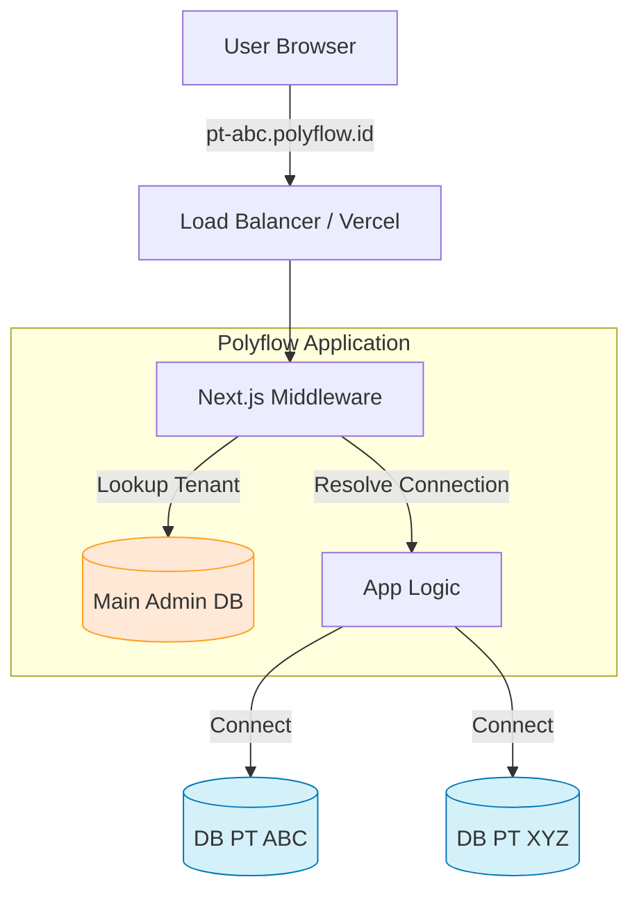

# Architecture Strategy: Multi-Tenant Expansion (SaaS)

## 1. Overview
This document outlines the strategy for evolving **Polyflow** into a SaaS-ready, multi-tenant ERP system capable of serving multiple companies (PTs) simultaneously while maintaining strict data isolation.

**Selected Approach:** Option 1 - **Subdomain-based Routing with Isolated Databases.**

## 2. Core Architecture
-   **Routing**: Each Tenant (PT) is identified by a unique subdomain (e.g., `pt-abc.polyflow.id`, `pt-xyz.polyflow.id`).
-   **Data Isolation**: Every Tenant has its own dedicated PostgreSQL database.
-   **Central Management**: A "Main DB" (living at `app.polyflow.id` or `admin.polyflow.id`) handles tenant registration, billing, and routing maps (Subdomain -> Database URL).

### Diagram

## 3. Implementation Steps

### Phase 1: Infrastructure & "Main" Database
1.  **Create "Main" Database**: Holds `Tenants` table (`id`, `name`, `subdomain`, `db_url`, `status`).
2.  **DNS Configuration**: Setup wildcard DNS (`*.polyflow.id`) to point to the Next.js app.

### Phase 2: Middleware & Dynamic Connection
1.  **Middleware Update**:
    -   Extract subdomain from `request.nextUrl.host`.
    -   If subdomain is valid, fetch the `db_url` (cached in Redis for performance).
    -   Store `tenantId` in the request header.
2.  **Prisma Client Factory**:
    -   Instead of a global `prisma` singleton, create a factory that accepts a `datasourceUrl`.
    -   Instantiate a fresh Prisma Client for the request scope strictly bound to that tenant's DB.

### Phase 3: Deployment & Migration Pipeline
1.  **Migration Script**: A CI/CD script that loops through *all* tenant databases to apply `prisma migrate deploy` when code changes.
2.  **Onboarding Flow**:
    -   Admin creates new Tenant in "Main DB".
    -   System triggers a script to:
        1. Provision new PostgreSQL DB (e.g., via Neon/Supabase API or raw SQL).
        2. Run initial Prisma migrations/seeding.

## 4. Pros & Cons (Recap)
| Feature | Benefit | Trade-off |
| :--- | :--- | :--- |
| **Security** | **Highest**. Physical separation of data. | Managing migrations across 100+ DBs takes tooling. |
| **Performance** | Performance of one PT doesn't affect others. | Higher resource baseline (connection pools). |
| **Experience** | Professional `company.polyflow.id` URL. | Requires wildcard SSL & DNS setup. |

## 5. Next Actions
- [ ] Set up `Tenants` table in current DB (for testing simulation).
- [ ] Experiment with Dynamic Prisma Client in a separate branch.
- [ ] Configure `*.localhost` for local development testing.
