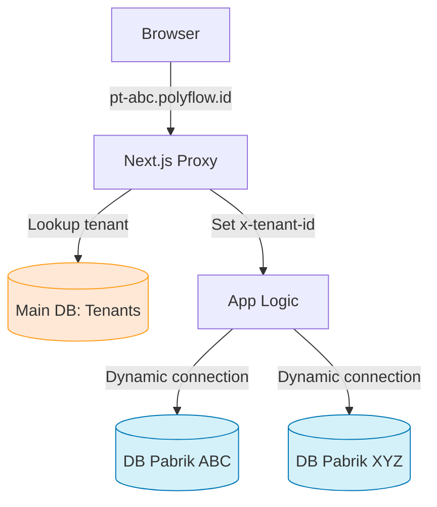
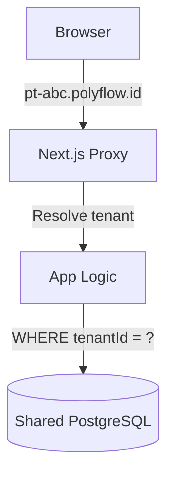

# Multi-Factory Expansion — Feasibility Analysis & Brainstorm

**Tanggal:** 15 Februari 2026
**Tujuan:** Mengevaluasi kelayakan membuka layanan PolyFlow ke pabrik lain dengan arsitektur database terpisah per tenant.

---

## 1. Jawaban Singkat: Apakah Memungkinkan?

**Ya, sangat memungkinkan.** Tapi butuh refactoring bertahap yang terencana. Berikut analisis lengkapnya.

---

## 2. Kondisi Codebase Saat Ini

### ✅ Yang Sudah Mendukung
| Aspek | Status | Catatan |
|:---|:---|:---|
| Schema lengkap (55+ models) | ✅ Siap | Semua model bisa di-clone ke DB baru |
| Prisma Migration | ✅ Siap | Bisa di-deploy ke banyak DB dengan loop script |
| Seed data (CoA, Locations, Machines) | ✅ Siap | Tinggal jalankan per tenant |
| Role-Based Access Control | ✅ Siap | User per DB = otomatis terisolasi |
| CI/CD Pipeline | ✅ Siap | Tinggal extend untuk multi-DB migration |

### ⚠️ Yang Perlu Refactoring
| Aspek | Masalah | Effort |
|:---|:---|:---|
| **Prisma Singleton** | `src/lib/prisma.ts` menggunakan 1 global instance | **MEDIUM** — Perlu factory pattern |
| **36+ Service Files** | Semua `import { prisma } from '@/lib/prisma'` langsung | **HIGH** — Perlu inject `prisma` sebagai parameter |
| **Auth** | `src/auth.ts` hardcode global `prisma` untuk `getUser()` | **MEDIUM** — Perlu tenant-aware lookup |
| **Server Actions** | Semua actions langsung pakai global prisma | **HIGH** — Perlu wrapper tenant resolver |
| **Proxy/Middleware** | `src/proxy.ts` belum ada tenant detection | **LOW** — Tambah subdomain parsing |

---

## 3. Opsi Arsitektur

### Opsi A: Database Terpisah per Pabrik (Isolated DB) ⭐ RECOMMENDED



**Cara Kerja:**
1. Setiap pabrik punya subdomain: `pt-abc.polyflow.id`, `pt-xyz.polyflow.id`
2. Proxy extract subdomain → lookup ke Main DB → dapat `DATABASE_URL` tenant
3. Prisma Client Factory membuat koneksi ke DB tenant yang tepat
4. Semua data 100% terisolasi (berbeda database)

| Pro | Contra |
|:---|:---|
| Keamanan tertinggi (data fisik terpisah) | Manage migrasi ke banyak DB butuh tooling |
| Performa tidak saling pengaruh | Connection pool lebih banyak |
| Backup/restore per tenant independen | Sedikit lebih mahal (1 DB per pabrik) |
| Bisa custom pricing per tenant | — |

---

### Opsi B: Shared DB dengan `tenantId` Column (Row-Level Isolation)



**Cara Kerja:**
1. Tambah kolom `tenantId` di SETIAP tabel (55+ model!)
2. Setiap query harus di-filter `WHERE tenantId = ?`
3. Semua data di satu database

| Pro | Contra |
|:---|:---|
| Simple deploy (1 DB saja) | **Risiko kebocoran data tinggi** (lupa WHERE clause) |
| Migrasi sekali jalan | Performa menurun seiring tenant bertambah |
| Murah (1 DB) | Modifikasi schema masif (55+ model ditambah `tenantId`) |
| — | Tidak bisa backup per tenant secara independen |

---

### Opsi C: Hybrid (Shared App + Isolated DB via Schema)

Menggunakan PostgreSQL schemas (bukan databases) untuk isolasi:
```sql
CREATE SCHEMA tenant_abc;
CREATE SCHEMA tenant_xyz;
```

| Pro | Contra |
|:---|:---|
| Satu DB, tapi data terisolasi per schema | Prisma kurang bagus support schema switching |
| Backup lebih mudah | Masih butuh factory pattern |
| Lebih murah dari Opsi A | Kurang umum, docs sedikit |

---

## 4. Rekomendasi: Opsi A (Isolated DB) — Implementasi Bertahap

> [!IMPORTANT]
> Opsi A adalah pilihan terbaik untuk PolyFlow karena:
> 1. Pabrik beda punya data yang **sangat sensitif** (harga, supplier, resep produksi)
> 2. Compliance lebih mudah (data client A tak bisa bocor ke client B)
> 3. PolyFlow sudah punya Prisma Migration yang bisa di-loop
> 4. Sudah ada dokumen strategi sebelumnya di `docs/plans/archive/2026-02-03-multi-tenant-strategy.md`

### Phase 1: Foundation (Effort: ~2-3 hari)

#### 1.1 Main Database & Tenant Registry
```prisma
// Di schema terpisah atau di DB utama
model Tenant {
  id          String   @id @default(uuid())
  name        String           // "PT ABC Plastik"
  subdomain   String   @unique // "pt-abc"
  dbUrl       String           // postgresql://...
  status      TenantStatus @default(ACTIVE)
  plan        String   @default("basic")
  createdAt   DateTime @default(now())
  updatedAt   DateTime @updatedAt
}

enum TenantStatus {
  ACTIVE
  SUSPENDED
  TRIAL
}
```

#### 1.2 Prisma Client Factory
```typescript
// src/lib/db-factory.ts
import { PrismaClient } from '@prisma/client';

const clients: Map<string, PrismaClient> = new Map();

export function getTenantDb(datasourceUrl: string): PrismaClient {
  if (!clients.has(datasourceUrl)) {
    clients.set(datasourceUrl, new PrismaClient({
      datasources: { db: { url: datasourceUrl } }
    }));
  }
  return clients.get(datasourceUrl)!;
}

// Cleanup pada shutdown
export async function disconnectAll() {
  for (const client of clients.values()) {
    await client.$disconnect();
  }
  clients.clear();
}
```

#### 1.3 Proxy Tenant Resolution
```typescript
// src/proxy.ts (tambahan)
const hostname = req.nextUrl.hostname;
const parts = hostname.split('.');
const subdomain = parts.length >= 3 ? parts[0] : null;

if (subdomain && subdomain !== 'app' && subdomain !== 'www') {
  // Lookup tenant DB URL (cached in memory/Redis)
  const tenant = await getTenant(subdomain);
  if (tenant) {
    req.headers.set('x-tenant-id', tenant.id);
    req.headers.set('x-tenant-db', tenant.dbUrl);
  }
}
```

### Phase 2: Service Refactoring (Effort: ~3-5 hari)

Refactor semua service agar menerima `PrismaClient` sebagai parameter:

```diff
// SEBELUM (tight coupling)
- import { prisma } from '@/lib/prisma';
- export class InventoryService {
-   static async getStats() {
-     return prisma.inventory.findMany({...});
-   }
- }

// SESUDAH (dependency injection)
+ import { PrismaClient } from '@prisma/client';
+ export class InventoryService {
+   constructor(private db: PrismaClient) {}
+   async getStats() {
+     return this.db.inventory.findMany({...});
+   }
+ }
```

> [!TIP]
> Ini bisa dilakukan **bertahap** per service domain:
> 1. Inventory services (4 files)
> 2. Production services (5 files)
> 3. Accounting services (6 files)
> 4. Purchasing services (5 files)
> 5. Sales services (3 files)
> 6. Sisanya (analytics, costing, dll)

### Phase 3: Auth & Onboarding (Effort: ~2 hari)

- Auth `getUser()` pakai tenant-specific DB
- Admin panel untuk create tenant baru
- Script auto-provision: create DB → migrate → seed → register

### Phase 4: Deployment & Tooling (Effort: ~2 hari)

- CI/CD: loop migrasi ke semua tenant DBs
- Health check per tenant
- Admin dashboard untuk monitoring tenants
- Wildcard SSL (`*.polyflow.id`)

---

## 5. Estimasi Total Effort

| Phase | Effort | Priority |
|:---|:---|:---|
| Phase 1: Foundation | 2-3 hari | 🔴 High |
| Phase 2: Service Refactoring | 3-5 hari | 🔴 High |
| Phase 3: Auth & Onboarding | 2 hari | 🟡 Medium |
| Phase 4: Deployment & Tooling | 2 hari | 🟡 Medium |
| **Total** | **~10-12 hari kerja** | — |

---

## 6. Pertanyaan untuk Diskusi

1. **Berapa pabrik target awal?** (2-3 pabrik pilot vs. langsung SaaS)
2. **Apakah semua pabrik pakai schema/BOM yang sama?** (plastik semua, atau ada variasi industri?)
3. **Hosting preference?** (Single VPS dengan multi-DB, atau managed DB seperti Neon/Supabase?)
4. **Pricing model?** (Per pabrik flat fee, atau usage-based?)
5. **Timeline?** (Mau mulai pilot kapan?)

---

## 7. Quick Win: Proof of Concept

Jika mau tes cepat tanpa refactor besar:

```bash
# 1. Clone database untuk "pabrik B"
createdb polyflow_factory_b

# 2. Apply semua migration
DATABASE_URL=postgresql://localhost/polyflow_factory_b npx prisma migrate deploy

# 3. Seed data awal
DATABASE_URL=postgresql://localhost/polyflow_factory_b npx prisma db seed

# 4. Jalankan app dengan env berbeda
DATABASE_URL=postgresql://localhost/polyflow_factory_b npm run dev -- --port 3001
```

Ini sudah bisa **buktikan** bahwa schema PolyFlow bisa jalan di database berbeda. Sisanya tinggal automasi routing.
