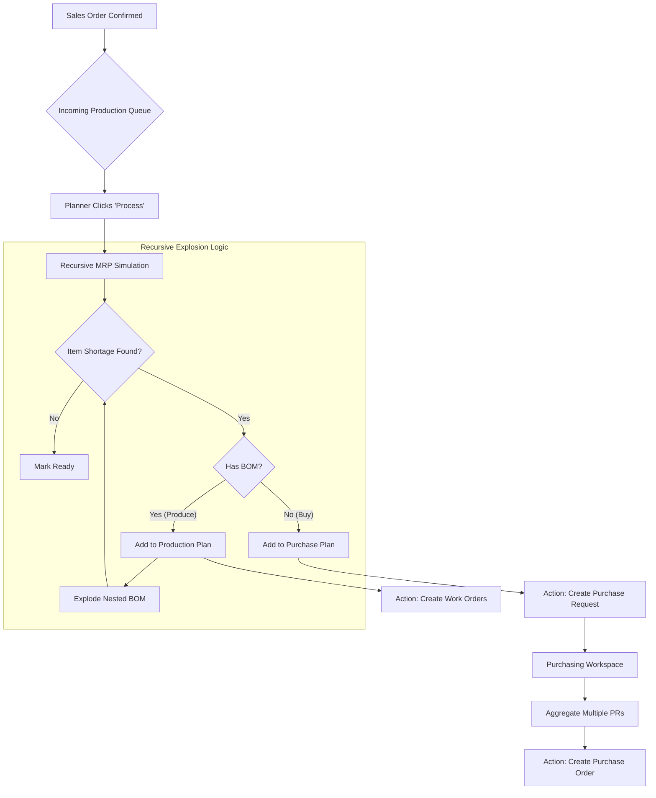

# Multi-level MRP Flow & Rules

This document outlines the logic and workflow for material requirement planning in PolyFlow, incorporating ERP best practices for intermediate goods and procurement aggregation.

## 1. Process Flow Diagram

## 2. Business Rules

### A. Automatic Decision Logic (Make vs. Buy)
- **Rule 1**: A product is considered "Make" if it has an active **BOM recipe**.
- **Rule 2**: A product is considered "Buy" if no BOM exists. This applies even if the `ProductType` is `INTERMEDIATE` but the recipe is missing (system fails safe to procurement).
- **Rule 3**: `ProductType` `RAW_MATERIAL` and `PACKAGING` should ideally never have BOMs and always go through the "Buy" path.

### B. Recursive Explosion
- **Rule 4**: The system must explode all levels of the product structure.
- **Rule 5**: Stock checks must occur at every level. If a sub-assembly exists in stock, the recursion for its children is skipped.

### C. Procurement Aggregation
- **Rule 6**: **Purchase Requests (PR)** are treated as "demand signals". They do not immediately reserve stock or commit funds.
- **Rule 7**: Planners/Purchasing can select multiple PRs for the same material (from different SOs/WOs) and consolidate them into a single **Purchase Order (PO)** to a supplier.

### D. Order Linking
- **Rule 8**: Every auto-generated PR must maintain a reference back to the source **Sales Order** or **Work Order** for traceability.

## 3. Implementation Phases

1.  **Phase 1 (Recursive Simulation)**: Update the "Run Simulation" button to show a tree-view of requirements (Produce vs. Buy).
2.  **Phase 2 (Bulk Creation)**: Update the "Process" button to generate the entire hierarchy of Work Orders at once.
3.  **Phase 3 (Purchasing Consolidation)**: Implement a UI in the Purchasing workspace to "Batch PRs to PO".

---
Does this flow and set of rules capture your requirements for the mixing and procurement process?
