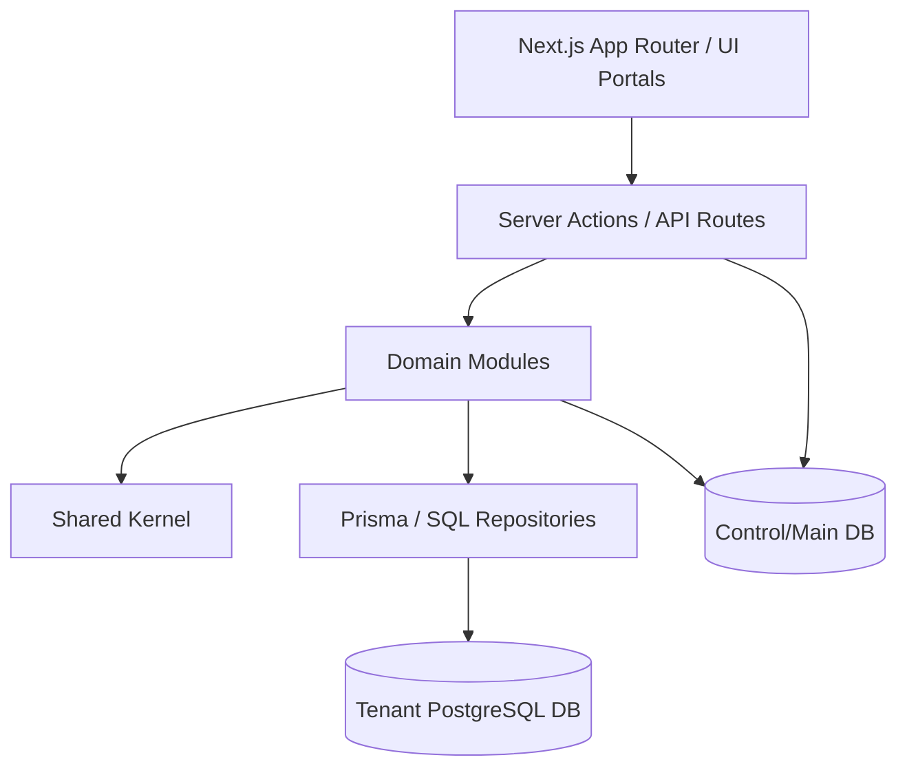
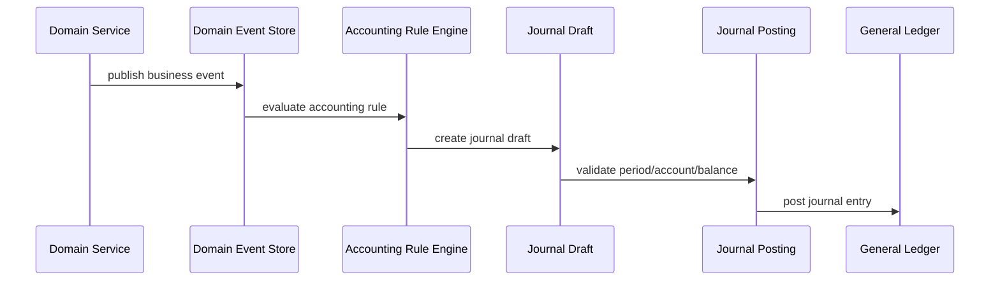

# PolyFlow v2 Architecture Roadmap

**Tanggal:** 2026-07-03  
**Status:** Official architecture planning document  
**Documentation hub:** `docs/polyflow-v2/`  
**Scope:** Evolusi arsitektur PolyFlow dari current modular monolith menuju platform ERP manufaktur yang lebih aman, scalable, dan mudah dikembangkan.  
**Audience:** Owner, engineering, operator, implementor, dan reviewer produksi.  

---

## 1. Executive Summary

PolyFlow saat ini sudah berada di jalur yang benar sebagai ERP manufaktur plastik berbasis **Next.js 16, Prisma, PostgreSQL, dan multi-tenant database-per-tenant**. Codebase sudah memiliki service layer di banyak domain (`inventory`, `production`, `finance`, `accounting`, `sales`, `purchasing`, `maklon`, dll.), schema domain map, tenant guardrail plan, dan dokumentasi arsitektur awal.

Masalah utama bukan stack teknologi, melainkan **batas domain, safety operasional, dan konsistensi data transaksi**. Karena itu rekomendasi utama adalah:

> Jangan rewrite total dan jangan pecah microservices dulu. Lanjutkan sebagai **modular monolith** yang lebih disiplin, dengan fondasi **tenant-safe, ledger-first, event-driven accounting, dan reporting-ready**.

Roadmap ini mendesain PolyFlow v2 sebagai evolusi bertahap:

1. Stabilkan arsitektur dan aturan dependency.
2. Formalisasi module boundary.
3. Jadikan tenant/ops safety sebagai fondasi.
4. Jadikan inventory ledger sebagai source of truth.
5. Jadikan accounting auto-journal berbasis domain events.
6. Pecah production secara konseptual menjadi planning, execution, dan costing.
7. Siapkan reporting read model agar data besar tetap ringan.
8. Batasi AI assistant ke tool yang aman, tenant-aware, permission-aware, dan audited.

---

## 2. Current Baseline

Baseline ini disusun dari kondisi repo lokal pada 2026-07-03.

### 2.1 Stack saat ini

| Layer | Current |
|---|---|
| Framework | Next.js 16 App Router |
| Language | TypeScript |
| Runtime UI | React 19 |
| ORM | Prisma 5 |
| Database | PostgreSQL |
| Auth | NextAuth/Auth.js v5 |
| UI | shadcn/Radix/Tailwind |
| Test | Vitest |
| Deployment | Docker/Compose + CI/CD |

### 2.2 Folder utama saat ini

| Folder | Fungsi |
|---|---|
| `src/app` | App Router pages, layouts, API routes |
| `src/components` | UI components per portal/domain |
| `src/actions` | Server Actions per domain |
| `src/services` | Business/service layer per domain |
| `src/lib` | shared utilities, schemas, auth, tenant, config |
| `prisma` | Prisma schema, migrations, seed |
| `scripts` | operational scripts, import, repair, audit |
| `docs` | architecture, runbook, plans, SOP |

### 2.3 Current size indicator

| Area | Jumlah file indikatif |
|---|---:|
| `src/app` | 223 |
| `src/components` | 265 |
| `src/actions` | 91 |
| `src/services` | 139 |
| `src/lib` | 102 |

Dominasi domain saat ini:

- `finance`, `production`, `sales`, `warehouse`, `purchasing` di route/UI.
- `production`, `finance`, `accounting`, `inventory` di service layer.
- Banyak script operasional di `scripts/`, termasuk import, repair, audit, tenant tools.

### 2.4 Domain model besar saat ini

Prisma schema saat ini mencakup domain:

- Access control dan shared actors.
- Master data.
- Inventory, catalog, manufacturing core.
- Sales, purchasing, fulfillment.
- Finance & Accounting core.
- Shared sequence, payment, returns.
- Platform dan multi-tenant extension.

Model high-risk yang perlu diperlakukan sebagai shared kernel:

- `User`
- `Customer`
- `Supplier`
- `Location`
- `ProductVariant`
- `StockMovement`
- `Inventory`
- `ProductionOrder`
- `Invoice`
- `PurchaseInvoice`
- `Payment`
- `JournalEntry`
- `JournalLine`
- `Tenant`

### 2.5 Strength saat ini

| Area | Strength |
|---|---|
| Stack | Modern, cukup standard, tidak perlu ganti teknologi |
| Domain | Sudah sangat nyata dan dekat kebutuhan operasional manufaktur |
| Service layer | Sudah ada dan cukup luas |
| Multi-tenancy | Sudah database-per-tenant, isolasi kuat |
| Finance & Accounting | Sudah ada double-entry accounting foundation |
| Inventory | Sudah ada movement, balance, reservation, opname |
| Production | Sudah ada BOM, WO, execution, output, scrap, downtime, costing |
| Documentation | Sudah ada architecture, schema domain map, tenant guardrail, runbook |

### 2.6 Risk saat ini

| Risk | Dampak |
|---|---|
| Tenant operation ambiguity | Salah target DB bisa fatal |
| Stock mutation tersebar | Balance bisa drift dari movement |
| Historical stock/report berat | Timeout ketika data membesar |
| Auto-journal coupling | Logic finance bisa tersebar di sales/purchase/production |
| Fat actions/pages | Business rule susah dites dan reuse |
| One-off scripts | Sulit audit, rawan salah tenant, rawan no rollback |
| Reporting query langsung ke transaksi | Lambat dan rawan mengunci DB saat data besar |
| AI assistant tanpa policy ketat | Potensi baca data sensitif atau cross-tenant |

---

## 3. Architecture Decision

### 3.1 Keputusan utama

PolyFlow v2 tetap memakai pendekatan:

> **Modular Monolith, bukan microservices.**

Alasan:

1. Domain ERP masih sangat saling terkait.
2. Tim akan lebih cepat dengan satu deployable unit.
3. Cross-domain transaction masih sering dibutuhkan.
4. Microservices akan menambah overhead messaging, observability, distributed transaction, dan ops.
5. Bottleneck saat ini bukan batas deploy service, tetapi disiplin domain, ledger, tenant safety, dan reporting.

### 3.2 Non-goals

Roadmap ini **bukan**:

- Rewrite total aplikasi.
- Migrasi langsung ke microservices.
- Mengganti Next.js/Prisma/PostgreSQL tanpa alasan kuat.
- Merombak semua folder sekaligus.
- Menjalankan migration/seed/repair production tanpa target DB, backup, dan approval eksplisit.
- Membuat AI assistant yang bebas menjalankan SQL/write operation.

### 3.3 Guiding principles

1. **Tenant-first.** Semua operasi harus eksplisit tenant target.
2. **Ledger-first.** Mutasi stok dan finance harus punya jejak ledger.
3. **Service-first.** Business logic hidup di service/domain layer, bukan UI.
4. **Actions are adapters.** Server Actions hanya auth, validation, service call, revalidate.
5. **Reports are read models.** Report berat tidak selamanya query transaksi mentah.
6. **Additive migration.** Perubahan besar dilakukan bertahap dan backward-compatible.
7. **Dry-run by default untuk ops.** Semua repair/import/write script harus aman dulu.
8. **Tests follow risk.** Test paling kuat di inventory, finance/accounting, production, tenant ops.
9. **Boring over clever.** Pilih desain mudah dibaca, mudah diaudit, dan mudah dioperasikan.

---

## 4. Target Architecture

### 4.1 High-level target



### 4.2 Target folder structure

Target jangka panjang:

```txt
src/
  app/
    (public)/
    dashboard/
    warehouse/
    production/
    finance/
    sales/
    purchasing/
    kiosk/
    admin/
    api/

  modules/
    tenancy/
    identity/
    master-data/
    inventory/
    production/
    finance/
      accounting-core/
      operations/
      reconciliation/
      budgeting/
      tax/
      reports/
    sales/
    purchasing/
    warehouse/
    maklon/
    reporting/
    ai-assistant/

  shared/
    db/
    auth/
    errors/
    schemas/
    result/
    serialization/
    observability/
    ui/
    utils/
```

Namun migrasi dilakukan bertahap. Tidak perlu langsung memindahkan seluruh `src/services` dan `src/actions`.

### 4.3 Transitional structure

Selama migrasi:

```txt
src/actions/<domain>      # tetap ada
src/services/<domain>     # tetap ada
src/lib/schemas/<domain>  # tetap ada
src/modules/<domain>      # dipakai untuk domain yang sedang dipilotkan
```

Rule:

- Fitur baru boleh mulai di `src/modules`.
- Fitur lama tidak perlu dipindah kecuali sedang disentuh.
- Jangan pindah file massal tanpa value bisnis.

### 4.4 Module contract

Official module template lives at:

```txt
src/modules/_template/
```

All PolyFlow v2 planning/reference documents should live under:

```txt
docs/polyflow-v2/
```

Setiap module idealnya punya contract:

```txt
src/modules/<domain>/
  actions/        # adapter untuk server action/API jika diperlukan
  services/       # use case dan business rules
  repositories/   # Prisma/raw SQL access
  schemas/        # Zod input/output/domain validation
  events/         # domain events yang module publish/consume
  policies/       # permission/domain policy
  tests/          # service/repository tests
  index.ts        # public exports
```

### 4.5 Dependency rule

Allowed:

```txt
app -> actions -> modules/services -> repositories -> db
app -> components
components -> actions/hooks only when interactive
services -> shared utilities
repositories -> prisma/sql
```

Not allowed:

```txt
app/page -> prisma
component -> prisma
component -> accounting posting
action -> complex business calculation
inventory -> import finance UI code
production -> mutate journal line directly without accounting contract
script -> write tenant DB without preflight
```

### 4.6 Public API per module

Setiap module harus punya public API yang jelas. Contoh:

```ts
// src/modules/inventory/index.ts
export { InventoryLedgerService } from "./services/inventory-ledger-service";
export { InventoryBalanceService } from "./services/inventory-balance-service";
export type { StockCommand, StockLedgerEntry } from "./types";
```

File luar module sebaiknya import dari `index.ts`, bukan import internal path acak.

---

## 5. Domain Module Blueprint

### 5.1 Tenancy module

**Purpose:** Resolve tenant, enforce tenant safety, manage tenant health, migration, backup, restore.

Target responsibilities:

- Resolve subdomain ke tenant metadata.
- Resolve tenant slug ke DB target.
- Tenant health check.
- Tenant backup and restore workflow.
- Tenant migration status.
- Operation logging.
- Guardrail untuk write operation.

Target structure:

```txt
src/modules/tenancy/
  services/
    tenant-resolver-service.ts
    tenant-health-service.ts
    tenant-backup-service.ts
    tenant-migration-service.ts
    tenant-operation-log-service.ts
  policies/
    tenant-operation-policy.ts
  repositories/
    tenant-repository.ts
  schemas/
    tenant-operation.schema.ts
```

Acceptance criteria:

- Semua command operasional bisa menyebut tenant slug, bukan DB name mentah.
- Write operation menampilkan tenant + DB + intent.
- Production write wajib backup/approval path.
- Tenant health bisa dijalankan read-only.

### 5.2 Identity and access module

**Purpose:** User, role, permission, session policy, API keys.

Responsibilities:

- Login/session.
- Role/workspace access.
- API key lifecycle.
- Audit auth-sensitive event.
- Portal-level authorization.

Rules:

- Super admin isolated ke admin workspace.
- Tenant user tidak boleh akses admin workspace.
- Role access harus central di policy, bukan hardcoded tersebar.
- Mobile redirect policy harus bisa dites.

### 5.3 Master data module

**Purpose:** Shared entities: customer, supplier, location, product catalog basics.

Responsibilities:

- Customer/supplier master.
- Location lifecycle.
- Product/ProductVariant core.
- SKU and UOM rules.
- Customer product price and supplier product mapping.

Rules:

- `Location` dan `ProductVariant` dianggap shared kernel.
- Perubahan field shared harus additive dan ditinjau lintas domain.
- Tidak boleh repurpose semantic field lama tanpa migration plan.

### 5.4 Inventory module

**Purpose:** Semua stok, movement, balance, reservation, opname, valuation-sensitive movement.

Target responsibilities:

- Stock ledger.
- Inventory balance.
- Reservation.
- Transfer.
- Adjustment.
- Opname.
- Stock as-of.
- Stock valuation hooks.
- Consistency audit.

Target service:

```txt
InventoryLedgerService
InventoryBalanceService
InventoryReservationService
InventoryTransferService
InventoryAdjustmentService
InventoryOpnameService
InventoryAuditService
InventoryValuationService
```

Golden rule:

> Tidak ada perubahan stok tanpa ledger entry.

### 5.5 Production module

**Purpose:** Manufacturing planning, execution, output, material issue, scrap, downtime, costing handoff.

Subdomain:

```txt
production-planning
production-execution
production-costing
```

Responsibilities:

- BOM and routing/process definition.
- MRP and material requirement.
- Work order lifecycle.
- Execution start/stop.
- Output recording.
- Material issue/backflush.
- Scrap and QC.
- Downtime.
- Production cost handoff.

Rules:

- Execution state machine eksplisit.
- Material issue harus lewat inventory command.
- Finished goods output harus lewat inventory command.
- Accounting impact lewat event/rule, bukan direct journal mutation sembarang.

### 5.6 Sales module

**Purpose:** Commercial demand, quotation, sales order, delivery, invoice trigger, return.

Responsibilities:

- Customer quotation.
- Sales order.
- Delivery order.
- Sales invoice lifecycle.
- Sales return.
- Credit/receivable handoff.
- Mobile sales workflow.
- Sales visit.

Rules:

- Delivery yang memengaruhi stok publish domain event.
- Invoice yang memengaruhi accounting publish domain event.
- Sales return harus jelas efek ke stock, AR, revenue, tax.

### 5.7 Purchasing module

**Purpose:** Procurement request, purchase order, goods receipt, purchase invoice, payment handoff, return.

Responsibilities:

- Purchase request.
- Purchase order.
- Goods receipt.
- Purchase invoice.
- Purchase return.
- Supplier product mapping.
- Procurement analytics.

Rules:

- Goods receipt yang menambah stok harus lewat inventory ledger.
- Purchase invoice posting harus lewat accounting event.
- Legacy `PurchasePayment` perlu audit sebelum consolidation/removal.

### 5.8 Finance & Accounting module

**Purpose:** Satu parent domain untuk seluruh proses keuangan, dengan **Accounting Core** sebagai mesin pembukuan yang strict dan **Finance Operations** sebagai workflow operasional harian.

Decision:

- `Finance & Accounting` diperlakukan sebagai **satu bounded context besar**.
- `Accounting Core` bukan departemen/module produk terpisah; ia adalah subdomain paling ketat di dalam Finance & Accounting.
- Current repo masih punya `src/services/accounting/*` dan `src/services/finance/*` karena sejarah implementasi. Jangan merge folder secara big-bang; untuk development baru, treat keduanya sebagai satu domain konseptual.

Target structure:

```txt
src/modules/finance/
  accounting-core/
    rules/
    journal-drafts/
    posting/
    reversal/
    period-locks/
    account-resolver/
  operations/
    payments/
    petty-cash/
    fixed-assets/
  reconciliation/
  budgeting/
  tax/
  reports/
```

#### Accounting Core responsibilities

- Chart of accounts.
- Journal posting.
- Journal validation.
- Fiscal period lock.
- Account mapping policy.
- General ledger.
- Trial balance source.
- Inventory-GL reconciliation.
- Journal reversal and correction policy.
- Accounting rule engine for domain events.

Target services:

```txt
AccountingRuleService
JournalDraftService
JournalPostingService
JournalReversalService
PeriodLockService
AccountResolverService
InventoryGlReconciliationService
```

Golden rule:

> Journal yang posted tidak diedit langsung; koreksi lewat reversal/adjustment.

#### Finance Operations responsibilities

- AR/AP payment.
- Petty cash.
- Fixed asset.
- Budgeting.
- Tax.
- Bank reconciliation.
- Aging.
- Finance reports UI.

Rules:

- Finance Operations boleh membuat request posting ke Accounting Core.
- Accounting Core tetap pemilik journal integrity.
- Domain lain tidak boleh mutate `JournalEntry`/`JournalLine` langsung tanpa Accounting Core contract.
- UI finance boleh mengorkestrasi workflow, tapi tidak boleh melakukan balancing journal sendiri.

### 5.9 Maklon module

**Purpose:** Workflow khusus maklon yang menyentuh sales, warehouse, production, dan finance.

Responsibilities:

- Maklon receipt.
- Maklon material return.
- Maklon cost item.
- Maklon report.
- Maklon-specific stock location policy.

Rules:

- Maklon tidak boleh menjadi special case liar di semua domain.
- Maklon harus punya adapter/event yang jelas ke inventory, sales, accounting.

### 5.10 Reporting module

**Purpose:** Read model, snapshot, analytics, dashboard-heavy query.

Responsibilities:

- Stock daily snapshot.
- Trial balance snapshot.
- AR/AP aging snapshot.
- Production daily summary.
- Sales/purchase summary.
- Material variance summary.
- Report rebuild jobs.

Rules:

- Report berat tidak harus query transaction tables langsung.
- Snapshot harus bisa direbuild.
- Report harus menyimpan metadata periode dan source freshness.

### 5.11 AI assistant module

**Purpose:** AI/chatbot with tenant-safe and permission-safe tools.

Responsibilities:

- Tool registry.
- Read-only analytics tools.
- Role-aware response policy.
- Query audit.
- Tenant scope enforcement.
- Guardrails.

Rules:

- Tidak boleh raw SQL bebas.
- Tidak boleh cross-tenant.
- Tidak boleh mutation tanpa explicit approval flow.
- Semua query harus audited.

---

## 6. Ledger-First Inventory Design

### 6.1 Target model

Inventory harus diperlakukan seperti accounting:

```txt
StockLedger        = sumber kebenaran historis
InventoryBalance   = current snapshot/cache
StockReservation   = komitmen stok
StockValuation     = costing/valuation state
StockAuditRun      = hasil audit konsistensi
```

### 6.2 Stock command pattern

Semua mutasi stok dikemas sebagai command:

```ts
type StockCommand =
  | ReceiveStockCommand
  | IssueStockCommand
  | TransferStockCommand
  | AdjustStockCommand
  | ReserveStockCommand
  | ReleaseReservationCommand
  | PostProductionOutputCommand
  | PostSalesDeliveryCommand
  | PostPurchaseReturnCommand
  | PostSalesReturnCommand;
```

Command minimal membawa:

- tenant context
- source document type
- source document id
- product variant
- location source/destination
- quantity
- unit
- unit cost jika valuation-sensitive
- user/operator
- timestamp transaksi
- idempotency key

### 6.3 Ledger invariants

Invariants:

1. Ledger entry immutable setelah posted.
2. Koreksi dibuat dengan reversal/adjustment.
3. Balance adalah hasil ledger, bukan source utama.
4. Negative stock hanya boleh jika policy explicit.
5. Reservation tidak mengubah physical stock, hanya available stock.
6. Opname variance harus masuk ledger sebagai adjustment yang jelas.
7. Transfer menghasilkan dua sisi movement yang terhubung.
8. Cost-sensitive movement harus memiliki valuation metadata.

### 6.4 Stock consistency audit

Audit minimal:

```txt
For each productVariant + location:
  expected = sum(ledger in/out)
  actual = Inventory.quantity
  diff = actual - expected
```

Output:

- no issue
- warning minor rounding
- error mismatch
- missing inventory balance
- orphan movement
- suspicious negative stock
- cost mismatch

### 6.5 Migration strategy

Karena sudah ada `StockMovement` dan `Inventory`, strategi aman:

1. Jangan langsung hapus model lama.
2. Jadikan `StockMovement` sebagai ledger existing jika cukup.
3. Tambah field metadata secara additive jika perlu:
   - source type
   - source id
   - idempotency key
   - posted/reversed marker
   - valuation metadata
4. Buat service wrapper baru.
5. Pindahkan mutasi domain satu per satu lewat wrapper.
6. Jalankan audit periodik.

---

## 7. Event-Driven Accounting Design

### 7.1 Problem yang diselesaikan

ERP menyentuh finance dari banyak arah:

- Purchase receipt.
- Purchase invoice.
- Sales invoice.
- Payment received/sent.
- Production output.
- Material issue.
- Stock adjustment.
- Return.
- Petty cash.

Jika semua domain langsung membuat journal sendiri, logic accounting akan tersebar dan sulit diaudit.

### 7.2 Target flow



### 7.3 Domain event examples

```txt
GoodsReceived
PurchaseInvoicePosted
SupplierPaymentSent
SalesInvoicePosted
CustomerPaymentReceived
SalesDeliveryPosted
SalesReturnPosted
PurchaseReturnPosted
MaterialIssuedToProduction
ProductionOutputPosted
StockAdjusted
PettyCashTransactionPosted
FixedAssetAcquired
```

### 7.4 Event schema minimum

```ts
type DomainEvent = {
  id: string;
  tenantId: string;
  type: string;
  sourceModule: string;
  sourceDocumentType: string;
  sourceDocumentId: string;
  occurredAt: Date;
  idempotencyKey: string;
  payload: unknown;
  status: "PENDING" | "PROCESSED" | "FAILED" | "IGNORED";
};
```

### 7.5 Accounting rule output

Accounting rule menghasilkan journal draft:

```ts
type JournalDraft = {
  eventId: string;
  referenceType: string;
  referenceId: string;
  transactionDate: Date;
  memo: string;
  lines: Array<{
    accountCode: string;
    debit: number;
    credit: number;
    description?: string;
  }>;
};
```

### 7.6 Posting invariants

1. Total debit harus sama dengan total credit.
2. Fiscal period harus open.
3. Account harus aktif dan sesuai type.
4. Idempotency key mencegah double posting.
5. Posted journal tidak diedit langsung.
6. Void/correction lewat reversal.
7. Journal harus menyimpan reference type/id.

### 7.7 Migration strategy

1. Inventory dan production tetap jalan dengan service existing.
2. Tambah event table/service secara additive.
3. Pilot 1 event low-risk.
4. Pilot event yang high-value:
   - `GoodsReceived`
   - `ProductionOutputPosted`
5. Bandingkan auto-journal lama vs event-generated journal.
6. Cutover per event type, bukan big bang.

---

## 8. Tenant Safety and Operations

### 8.1 Core principle

> Operator memilih tenant slug, bukan nama database mentah.

Contoh:

```bash
npm run ops -- tenant:health --tenant kiyowo
npm run ops -- tenant:backup --tenant melindo
npm run ops -- inventory:audit --tenant kiyowo --readonly
```

Jangan:

```bash
psql -d polyflow
DATABASE_URL=... node scripts/random-fix.js
```

### 8.2 Target ops command framework

Target:

```txt
scripts/ops/
  cli.ts
  tenancy/
  inventory/
  finance/
  production/
  imports/
  repairs/
```

Command classes:

| Class | Default | Requirement |
|---|---|---|
| read-only | allowed | tenant explicit |
| dry-run write | dry-run | tenant explicit |
| write | blocked by default | tenant + backup + confirmation |
| destructive | blocked | explicit approval + backup + rollback |

### 8.3 Operation preflight

Semua write script harus print:

```txt
Operation: repair-maklon-stock-location
Intent: WRITE
Environment: production
Tenant: kiyowo
Resolved DB: polyflow
Backup required: yes
Backup found: backups/prod-main-...
Dry run: false
Operator confirmation: required
```

### 8.4 Operation log

Setiap command write harus mencatat:

- operation id
- operator
- tenant
- db target
- command name
- arguments sanitized
- dry-run or write
- started at
- finished at
- status
- rows affected
- backup reference
- rollback notes

### 8.5 Backup and rollback policy

| Operation | Backup wajib? | Rollback |
|---|---:|---|
| read-only audit | no | n/a |
| import preview | no | n/a |
| import write | yes | reversal/delete batch if supported |
| migration | yes | restore/forward fix |
| repair stock | yes | reversal movement |
| repair journal | yes | reversal journal |
| destructive reset | yes + explicit approval | restore DB |

---

## 9. Reporting Read Model Strategy

### 9.1 Why

ERP report semakin lama semakin berat. Query langsung ke transaction tables untuk semua dashboard/report akan bermasalah ketika data membesar.

### 9.2 Target read models

| Read model | Source | Use case |
|---|---|---|
| `InventoryDailySnapshot` | stock ledger | stock as-of, inventory dashboard |
| `StockValuationSnapshot` | stock ledger + valuation | inventory value, HPP |
| `TrialBalanceSnapshot` | journal lines | finance report |
| `ARAgingSnapshot` | invoices/payments | AR aging |
| `APAgingSnapshot` | purchase invoices/payments | AP aging |
| `ProductionDailySummary` | execution/output/scrap | production dashboard |
| `MaterialVarianceSummary` | BOM vs actual issue | variance report |
| `SalesDailySummary` | SO/invoice/payment | sales dashboard |
| `PurchaseDailySummary` | PO/GR/invoice | purchasing analytics |

### 9.3 Snapshot rules

1. Snapshot bisa direbuild.
2. Snapshot menyimpan `sourceRange` dan `generatedAt`.
3. Snapshot tidak menggantikan transaksi source.
4. Report UI harus menampilkan freshness jika perlu.
5. Manual rebuild command tersedia untuk operator.

### 9.4 Recommended sequence

1. Inventory stock-as-of.
2. Trial balance.
3. AR/AP aging.
4. Production daily summary.
5. Material variance.

---

## 10. UI and Portal Strategy

### 10.1 Current portal strategy

PolyFlow sudah punya portal:

- Public/landing.
- Dashboard.
- Warehouse.
- Production.
- Finance & Accounting.
- Sales.
- Purchasing.
- Kiosk.
- Admin.

Ini dipertahankan.

### 10.2 UI contract per module

Setiap domain sebaiknya punya pola halaman konsisten:

```txt
/<portal>/<domain>              list/dashboard
/<portal>/<domain>/create       create
/<portal>/<domain>/<id>         detail
/<portal>/<domain>/<id>/edit    edit if needed
/<portal>/<domain>/import       import
/<portal>/<domain>/reports      reports
```

### 10.3 Component rule

| Component type | Boleh melakukan |
|---|---|
| Server page | fetch data via action/service adapter |
| Client form | manage form state, call action |
| Table/list | display, filter UI, trigger action |
| Dialog/drawer | interaction UI |
| Service | business logic |

UI tidak boleh:

- Menghitung journal.
- Mengubah stock langsung.
- Memutuskan valuation.
- Query Prisma langsung.
- Mengandung business branching kompleks yang tidak dites.

---

## 11. Testing Strategy

### 11.1 Test pyramid untuk PolyFlow

Prioritas test:

```txt
Service/domain tests        high priority
Repository/query tests      selective
Action adapter tests        medium
UI component tests          selective
E2E smoke tests             critical flows only
```

### 11.2 Critical test coverage

| Domain | Critical tests |
|---|---|
| Tenant | resolver, no cross-tenant, ops preflight |
| Inventory | receive, issue, transfer, adjustment, reservation, opname |
| Finance & Accounting | balanced journal, period lock, reversal, idempotency, AR/AP/payment workflows |
| Production | output, backflush, scrap, unit conversion, costing |
| Sales | delivery, invoice, payment, return |
| Purchasing | receipt, invoice, payment, return |
| Reporting | snapshot rebuild, stock as-of, trial balance |
| AI | permission, tenant scope, read-only enforcement |

### 11.3 Minimum verification per change

| Change type | Verification |
|---|---|
| Docs only | review diff |
| UI only | `npm run lint`, targeted visual/manual check |
| Service logic | targeted Vitest + lint |
| Prisma schema | migration review + generated client + targeted test |
| Tenant/DB ops | dry-run + backup plan + explicit target |
| Production data repair | backup + dry-run + row-count verification |

---

## 12. Roadmap Phases

## Phase 0 — Architecture Baseline and Safety Freeze

**Goal:** Menetapkan aturan main sebelum refactor besar.

### Deliverables

- Dokumen roadmap ini.
- Module boundary agreement.
- Dependency rule.
- Critical risk map.
- Baseline lint/test/build status.
- Daftar script write-risk.

### Tasks

1. Review `src/actions`, `src/services`, `src/lib`, `scripts`.
2. Tandai fat action/page yang paling riskan.
3. Buat daftar write scripts dan dry-run status.
4. Tetapkan `app -> actions -> services -> repositories -> db`.
5. Dokumentasikan high-risk seams:
   - inventory ↔ accounting
   - production ↔ inventory
   - production ↔ accounting
   - sales ↔ inventory/accounting
   - purchasing ↔ inventory/accounting
   - maklon ↔ inventory/sales/accounting

### Acceptance criteria

- Tim punya satu dokumen rujukan.
- Tidak ada refactor besar tanpa module boundary.
- Semua production/tenant operation wajib target tenant eksplisit.

---

## Phase 1 — Module Boundary Pilot

**Goal:** Membuat pattern module yang bisa ditiru tanpa memindahkan seluruh repo.

### Recommended pilot

`inventory` karena:

- impact tinggi.
- sudah punya service layer.
- punya risiko data nyata.
- bisa dites secara service-level.

### Deliverables

```txt
src/modules/inventory/
  README.md
  index.ts
  services/
  repositories/
  schemas/
  events/
  tests/
```

### Tasks

1. Buat module template.
2. Pindahkan atau wrap hanya service kecil yang sedang disentuh.
3. Jangan mass move.
4. Tambah rule import.
5. Tambah tests untuk use case yang dipilotkan.

### Acceptance criteria

- Ada 1 module yang jadi contoh resmi.
- Existing app tetap jalan.
- Import path dan public API jelas.

---

## Phase 2 — Tenant Ops Hardening

**Goal:** Mengurangi risiko salah tenant/DB untuk semua operasi.

### Deliverables

- Tenant topology runbook.
- Tenant resolver command.
- Read-only psql wrapper.
- Write-intent psql wrapper.
- Operation preflight standard.
- Operation log model/design.

### Tasks

1. Standarisasi command tenant-first.
2. Audit scripts yang pakai hardcoded DB.
3. Tambah `--tenant`, `--dry-run`, `--confirm` untuk script prioritas.
4. Tulis runbook backup/restore per tenant.
5. Tambah safety prompt untuk production write.

### Acceptance criteria

- Tidak ada write script prioritas yang bisa jalan tanpa tenant target.
- Operator melihat resolved tenant + DB sebelum eksekusi.
- Dry-run jadi default untuk repair/import.

---

## Phase 3 — Inventory Ledger Foundation

**Goal:** Menjadikan stock ledger sebagai source of truth.

### Deliverables

- Inventory command interface.
- Inventory ledger service.
- Inventory balance reconciler.
- Stock consistency audit.
- Optimized stock-as-of query.
- Idempotency key untuk movement penting.

### Tasks

1. Audit semua stock mutation entry point.
2. Definisikan command contract.
3. Implement wrapper untuk receive/issue/transfer/adjust.
4. Pindahkan production output dan material issue ke command.
5. Buat audit balance vs movement.
6. Optimize historical stock query.

### Acceptance criteria

- Mutasi stok baru lewat service command.
- Audit bisa mendeteksi mismatch.
- Stock-as-of tidak O(N) in-memory untuk data besar.

---

## Phase 4 — Accounting Event Pilot

**Goal:** Membuat auto-journal lebih terpusat dan auditable.

### Deliverables

- Domain event table/service.
- Accounting rule engine basic.
- Journal draft service.
- Posting idempotency.
- Reversal policy.

### Pilot events

1. `GoodsReceived`
2. `ProductionOutputPosted`
3. `MaterialIssuedToProduction`

### Tasks

1. Definisikan event schema.
2. Publish event dari service pilot.
3. Generate journal draft dari rule.
4. Validasi journal balanced.
5. Post ke accounting.
6. Bandingkan dengan behavior existing.

### Acceptance criteria

- Event tidak double-post karena idempotency.
- Journal punya reference source yang jelas.
- Failure event bisa diinvestigasi.

---

## Phase 5 — Production Engine Cleanup

**Goal:** Memisahkan production planning, execution, dan costing secara konseptual.

### Deliverables

- Production state machine document.
- Execution service boundary.
- Material issue/backflush policy.
- Scrap policy.
- Unit conversion contract.
- Production cost audit.

### Tasks

1. Petakan semua status `ProductionOrder`.
2. Petakan semua entry point execution.
3. Buat state transition table.
4. Formalisasi backflush vs manual issue.
5. Pastikan output masuk inventory ledger.
6. Pastikan accounting impact lewat event/rule.

### Acceptance criteria

- Tidak ada transition status yang ambigu.
- Material dan output punya ledger trail.
- Costing bisa diaudit dari input/output/scrap.

---

## Phase 6 — Sales and Purchasing Flow Standardization

**Goal:** Menyamakan pola commercial document dan accounting/inventory handoff.

### Deliverables

- Sales document lifecycle.
- Purchase document lifecycle.
- Return policy.
- Payment lifecycle consolidation plan.
- Audit `Payment` vs `PurchasePayment`.

### Tasks

1. Definisikan lifecycle quotation → order → delivery → invoice → payment.
2. Definisikan lifecycle request → PO → GR → PI → payment.
3. Standarisasi status.
4. Standarisasi event handoff.
5. Audit dan rencanakan legacy payment surface.

### Acceptance criteria

- Status document tidak ambiguous.
- Return jelas efek stok dan journal.
- Payment canonical jelas.

---

## Phase 7 — Reporting Read Models

**Goal:** Menghindari report berat dari query transaksi mentah.

### Deliverables

- Snapshot design.
- Rebuild command.
- Initial read model untuk inventory stock-as-of.
- Trial balance snapshot.
- AR/AP aging snapshot.

### Tasks

1. Pilih report paling berat.
2. Buat snapshot table/model.
3. Buat rebuild job.
4. Buat verification query.
5. Pindahkan UI report ke read model.

### Acceptance criteria

- Report besar lebih cepat.
- Snapshot bisa direbuild.
- Freshness jelas.

---

## Phase 8 — AI Assistant Guardrails

**Goal:** AI assistant aman untuk tenant dan permission.

### Deliverables

- Tool registry.
- Permission policy.
- Tenant scope enforcement.
- Query audit.
- Read-only analytics tools.

### Tasks

1. Daftar semua AI tools yang boleh.
2. Klasifikasi tool read/write.
3. Disable raw SQL bebas.
4. Tambah audit log untuk AI query.
5. Tambah role-based data masking jika perlu.

### Acceptance criteria

- AI tidak bisa cross-tenant.
- AI tidak bisa mutate tanpa approval.
- AI query bisa diaudit.

---

## 13. 90-Day Execution Plan

### Month 1 — Architecture and safety foundation

| Week | Focus | Output |
|---|---|---|
| 1 | Finalisasi roadmap | Dokumen disetujui |
| 1 | Baseline checks | lint/test/build status dicatat |
| 2 | Script risk audit | daftar script read/write/destructive |
| 2 | Module template | contoh folder dan README |
| 3 | Tenant runbook | topology + targeting rules |
| 4 | Inventory pilot planning | command contract + test plan |

### Month 2 — Tenant hardening and inventory pilot

| Week | Focus | Output |
|---|---|---|
| 5 | Tenant resolver/wrapper | read wrapper ready |
| 6 | Write preflight | write wrapper dry-run |
| 7 | Inventory command pilot | receive/issue/transfer wrapper |
| 8 | Stock audit | balance vs movement report |

### Month 3 — Ledger and accounting pilot

| Week | Focus | Output |
|---|---|---|
| 9 | Stock-as-of optimization | DB-level query/read model |
| 10 | Domain event schema | event service draft |
| 11 | GoodsReceived event | journal draft pilot |
| 12 | ProductionOutput event | journal draft pilot + review |

---

## 14. Backlog by Priority

### P0 — Safety critical

- Tenant-first operation guardrails.
- Backup/restore runbook per tenant.
- Script write-risk audit.
- Stock consistency audit.
- Journal posting idempotency.
- Period lock enforcement review.

### P1 — Architecture foundation

- Module template.
- Dependency rule.
- Inventory command service.
- Accounting event schema.
- Production state machine.
- Repository boundary for heavy queries.

### P2 — Scalability

- Stock-as-of optimized.
- Trial balance snapshot.
- AR/AP aging snapshot.
- Production daily summary.
- Report rebuild command.

### P3 — Developer experience

- Module README template.
- Code owner / reviewer guide.
- Import boundary linting if feasible.
- Test factories/fixtures.
- Ops CLI ergonomics.

### P4 — Product enhancement

- AI assistant curated analytics.
- Better mobile sales flow.
- Kiosk/offline resilience.
- Advanced costing simulation.
- Multi-company consolidation if needed.

---

## 15. Implementation Rules

### 15.1 For new features

Use module pattern if feasible:

```txt
module schema -> service -> action -> UI
```

Checklist:

- [ ] Domain owner jelas.
- [ ] Input schema ada.
- [ ] Service test untuk business rule.
- [ ] Permission policy jelas.
- [ ] Tenant context aman.
- [ ] Accounting/inventory impact eksplisit.
- [ ] Report impact dipikirkan.

### 15.2 For bug fixes

Smallest useful change.

Checklist:

- [ ] Reproduce or understand root cause.
- [ ] Fix di layer yang benar.
- [ ] Tidak memperluas side effect.
- [ ] Tambah regression test jika critical.
- [ ] Jika data existing terdampak, buat repair plan terpisah.

### 15.3 For database migrations

Checklist:

- [ ] Additive jika mungkin.
- [ ] Backfill plan.
- [ ] Rollback/forward-fix note.
- [ ] Index impact dicek.
- [ ] Tenant migration behavior jelas.
- [ ] Production backup plan untuk high-risk.

### 15.4 For repair/import scripts

Checklist:

- [ ] `--tenant` wajib.
- [ ] `--dry-run` default.
- [ ] Print resolved DB.
- [ ] Print row count impact.
- [ ] Backup requirement jelas.
- [ ] Idempotency atau rerun behavior jelas.
- [ ] Operation log.

---

## 16. Risk Register

| Risk | Severity | Mitigation |
|---|---:|---|
| Salah target tenant DB | Critical | tenant-first resolver, preflight, backup |
| Stock balance drift | Critical | ledger service, audit, no direct balance mutation |
| Double journal posting | Critical | idempotency key, event status, unique reference |
| Report timeout | High | read model/snapshot |
| Big-bang refactor gagal | High | pilot module, additive migration |
| Script lama bypass guardrail | High | script audit, deprecate, wrapper |
| Production execution ambiguity | High | state machine, policy table |
| Cross-domain model change ripple | High | shared kernel review |
| AI leaking sensitive data | High | permission-aware tools, audit, no raw SQL |
| Prisma transaction timeout/race | Medium | row locking, transaction timeout review, DB-level queries |

---

## 17. Governance

### 17.1 Review required

Perubahan berikut butuh review ekstra:

- `prisma/schema.prisma` pada shared kernel models.
- Inventory movement/balance.
- Journal posting/reversal.
- Production execution/backflush/output.
- Tenant resolver/client/provisioning/migration.
- Scripts yang write production/tenant DB.
- AI tool yang membaca finance/customer/supplier data.

### 17.2 Architecture decision record

Untuk perubahan arsitektur besar, buat ADR:

```txt
docs/plans/YYYY-MM-DD-adr-<topic>.md
```

Format:

```txt
Context
Decision
Alternatives considered
Consequences
Rollback/migration notes
```

### 17.3 Definition of done per architecture work

Sebuah architecture task dianggap done jika:

- Dokumentasi updated.
- Code mengikuti module/dependency rule.
- Test atau verification relevan jalan.
- Risiko production/tenant disebut.
- Rollback atau forward-fix path jelas.

---

## 18. Suggested Next Actions

Urutan paling aman setelah dokumen ini:

1. Review dan approve roadmap.
2. Buat `src/modules/_template/README.md`.
3. Audit scripts write-risk di `scripts/`.
4. Buat tenant operation preflight standard.
5. Pilih inventory sebagai module pilot.
6. Buat inventory stock mutation map:
   - transfer
   - adjustment
   - production material issue
   - production output
   - goods receipt
   - sales delivery
   - returns
7. Buat stock consistency audit command read-only.
8. Baru lanjut Finance & Accounting event pilot.

---

## 19. Appendix A — Current references

Dokumen existing yang menjadi konteks:

- `docs/ARCHITECTURE.md`
- `docs/ARCHITECTURAL_HEALTH_CHECK.md`
- `docs/SCHEMA_DOMAIN_MAP.md`
- `docs/RUNBOOK.md`
- `docs/plans/2026-05-09-tenant-first-guardrails.md`
- `docs/AUTO_JOURNAL_COVERAGE.md`
- `docs/PAYMENT_MODEL_AUDIT.md`
- `docs/production-logic.md`
- `docs/MAKLON_STOCK_REPAIR.md`

---

## 20. Appendix B — Recommended module migration policy

Migration policy:

```txt
Do not move code just to move code.
Move or wrap code when:
  - feature is being changed,
  - bug fix touches domain logic,
  - repeated logic exists,
  - data risk is high,
  - tests need a stable boundary.
```

Preferred pattern:

1. Write/identify service test.
2. Extract pure business rule.
3. Wrap Prisma access behind repository if query is complex.
4. Keep server action thin.
5. Keep UI unchanged if possible.
6. Verify.

---

## 21. Appendix C — Thin Server Action pattern

Target:

```ts
"use server";

export async function postSomething(input: unknown) {
  const user = await requireAuth();
  const parsed = schema.safeParse(input);

  if (!parsed.success) {
    return failure(parsed.error.issues[0]?.message ?? "Invalid input");
  }

  try {
    const result = await SomeDomainService.post({
      input: parsed.data,
      actorId: user.id,
    });

    revalidatePath("/some/path");
    return success(result);
  } catch (error) {
    return failure(mapDomainError(error));
  }
}
```

Action tidak berisi:

- multi-step accounting logic.
- direct stock balance mutation.
- complex report aggregation.
- role branching yang tersebar.
- raw SQL kecuali sangat terisolasi dan justified.

---

## 22. Appendix D — Inventory command examples

### Receive stock

```txt
Command: ReceiveStock
Source: GoodsReceiptItem
Effect:
  + StockLedger IN
  + InventoryBalance increment
  + valuation update
  + domain event GoodsReceived if applicable
```

### Issue material to production

```txt
Command: IssueStock
Source: MaterialIssue / ProductionExecution
Effect:
  + StockLedger OUT
  + InventoryBalance decrement
  + WIP/cost event
```

### Production output

```txt
Command: PostProductionOutput
Source: ProductionExecution
Effect:
  + StockLedger IN finished goods
  + InventoryBalance increment
  + valuation/HPP metadata
  + domain event ProductionOutputPosted
```

### Sales delivery

```txt
Command: PostSalesDelivery
Source: DeliveryOrderItem
Effect:
  + StockLedger OUT
  + InventoryBalance decrement
  + COGS event when invoiced/delivered based on accounting policy
```

---

## 23. Appendix E — Production state machine draft

Draft status:

```txt
DRAFT
PLANNED
WAITING_MATERIAL
READY
IN_PROGRESS
PAUSED
COMPLETED
CANCELLED
VOIDED
```

Allowed transition example:

| From | To | Requirement |
|---|---|---|
| DRAFT | PLANNED | BOM/product/quantity valid |
| PLANNED | WAITING_MATERIAL | material shortage detected |
| PLANNED | READY | material available |
| READY | IN_PROGRESS | machine/operator assigned |
| IN_PROGRESS | PAUSED | downtime/hold reason |
| PAUSED | IN_PROGRESS | resume reason |
| IN_PROGRESS | COMPLETED | output recorded and material handled |
| any non-final | CANCELLED | no irreversible posting or reversal available |
| posted/final | VOIDED | reversal path required |

This state machine must be validated against actual current statuses before implementation.

---

## 24. Appendix F — Production rollout caution

Untuk semua perubahan yang menyentuh production/VPS/tenant database:

1. Jangan build image production langsung di VPS kecuali explicit instruction.
2. Source change lewat CI/CD.
3. Migration/seed/repair harus target DB eksplisit.
4. Backup dulu untuk write-risk.
5. Dry-run dulu untuk repair/import.
6. Log hasil dan row count.
7. Jangan lakukan destructive command tanpa approval eksplisit.

---

## 25. Final Recommendation

PolyFlow v2 sebaiknya dibangun sebagai:

> **ERP modular monolith yang tenant-safe, ledger-first, event-driven accounting, dan reporting-ready.**

Prioritas terdekat:

1. Tenant/ops safety.
2. Inventory ledger consistency.
3. Finance & Accounting event pilot.
4. Production state machine.
5. Reporting snapshots.

Ini memberi jalur pengembangan yang aman tanpa membuang domain knowledge dan fitur yang sudah ada.
