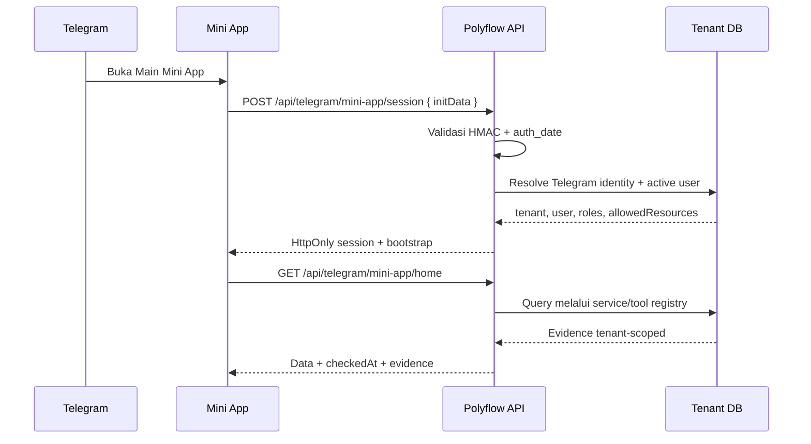

# Polyflow Telegram Mini App — Blueprint

**Tanggal:** 2026-07-30  
**Status:** DRAFT — untuk review produk dan keamanan  
**Scope:** MVP read-only, satu tenant, role ADMIN saja

## Keputusan yang Sudah Dikonfirmasi

| Item | Keputusan |
|---|---|
| Bot pilot | `@pico2004_bot` |
| User pilot | Hanya user Polyflow dengan role `ADMIN` yang masuk allowlist |
| Mode | Read-only |
| Tenant pilot | Melindo melalui host `melindo.polyflow.uk` |
| Notifikasi | Disiapkan sejak MVP; stok kritis aktif pertama |
| Mini App URL | `https://melindo.polyflow.uk/telegram` |

> Username bot bukan credential. Bot token tetap rahasia, wajib disimpan di secret/env, dan tidak boleh dimasukkan ke source code atau dokumen.

## 1. Keputusan Produk

Polyflow hadir di Telegram sebagai **Mini App**, bukan sebagai salinan seluruh ERP desktop.

- **Bot**: launcher, notifikasi, fallback chat, dan entry point account linking.
- **Mini App**: antarmuka utama untuk dashboard, pencarian data, detail, dan Virtual CS.
- **Backend Polyflow**: sumber data dan enforcement tenant/RBAC.
- **MVP**: read-only. Tidak ada create/update/delete/approve/post/void.

Telegram mendukung Mini App dari profile button, menu button, inline button, maupun direct link. Mini App menerima `Telegram.WebApp.initData` yang harus divalidasi di server sebelum dipakai.  
Referensi: [Telegram Mini Apps](https://core.telegram.org/bots/webapps)

## 2. Tujuan dan Non-Tujuan

### Tujuan

1. User membuka ringkasan operasional tanpa keluar dari Telegram.
2. User hanya melihat data tenant dan resource yang diizinkan.
3. Data berasal dari service/tool registry Polyflow, bukan SQL ad-hoc.
4. Setiap akses dapat diaudit berdasarkan Telegram user, Polyflow user, tenant, resource, dan waktu.
5. Mini App terasa ringan pada layar 320–412 px dan tetap usable pada Telegram Desktop.

### Non-Tujuan MVP

- Mengganti seluruh website Polyflow.
- Menyalin sidebar desktop dan semua form ERP.
- Menjalankan mutasi transaksi.
- Mendukung group chat sebagai konteks data.
- Membuat bot multi-tenant universal pada iterasi pertama.

## 3. Target User dan Pilot

- Tenant pilot: Melindo melalui `melindo.polyflow.uk`.
- User internal dengan role Polyflow `ADMIN` saja.
- Selain role `ADMIN`, user juga harus masuk allowlist pilot.
- Bot pilot: `@pico2004_bot`.
- Private chat saja.
- Device utama: Android/iOS; Telegram Desktop sebagai secondary.

Satu bot ini diarahkan ke tenant Melindo selama pilot. URL Mini App, tenant routing, dan kill switch menjadi lebih sederhana serta mengurangi risiko data tenant silang. Pemakaian bot yang sama untuk beberapa tenant baru dipertimbangkan setelah pilot stabil.

### Apa yang Dimaksud Domain Mini App?

Domain Mini App adalah alamat HTTPS halaman web Polyflow yang dibuka di dalam Telegram. Domain ini bukan username bot dan tidak harus membeli domain baru.

Untuk pilot, domain dan URL sudah dipilih:

```text
Domain/host : melindo.polyflow.uk
Path        : /telegram
Full URL    : https://melindo.polyflow.uk/telegram
```

URL tersebut baru dipasang sebagai **Main Mini App** dan menu button `Buka Polyflow` untuk `@pico2004_bot` setelah route `/telegram`, validasi session, dan security gate tersedia di deployment.

## 4. Information Architecture

```text
/telegram
├── /                       # bootstrap + redirect
├── /home                   # ringkasan role-aware
├── /data                   # daftar domain yang diizinkan
│   ├── /stock
│   ├── /sales
│   ├── /production
│   ├── /finance
│   └── /purchasing
├── /assistant              # Tanya Virtual CS
├── /notifications          # alert yang pernah diterima
└── /account                # user, tenant, koneksi, logout
```

### Bottom Navigation

| Tab | Isi |
|---|---|
| **Home** | KPI dan alert yang relevan dengan role |
| **Data** | Kartu domain: Stok, Sales, Produksi, Finance, Purchasing |
| **Tanya** | Virtual CS read-only |
| **Akun** | User, tenant, koneksi Telegram, bantuan, keluar |

Tab dan kartu bersifat **dynamic**. Kartu Finance tidak dirender jika user tidak memiliki resource finance; backend tetap wajib melakukan pengecekan ulang.

Pada pilot, terdapat gate tambahan: hanya role `ADMIN` yang masuk allowlist dapat melewati bootstrap Mini App.

## 5. Screen Blueprint

### 5.1 Launch / Account Linking

```text
┌─────────────────────────┐
│        Polyflow         │
│  Data operasional Anda  │
│                         │
│  Memverifikasi Telegram │
│  [spinner]              │
└─────────────────────────┘
```

State:

- **Linked** → `/home`.
- **Unlinked** → tampilkan `Hubungkan akun Polyflow`.
- **Tenant tidak ditemukan** → instruksi menghubungi admin.
- **User nonaktif/revoked** → akses ditolak dan support link.
- **initData expired/invalid** → minta buka ulang Mini App.

Account linking direkomendasikan melalui one-time link dari Polyflow, bukan berdasarkan username Telegram.

### 5.2 Home

```text
┌─────────────────────────────┐
│ Halo, Budi              ⋮   │
│ CV Melindo Jaya             │
├─────────────────────────────┤
│ Ringkasan hari ini          │
│ [Stok kritis] [SPK aktif]   │
│      12            4        │
│ [SO pending]  [Overdue]     │
│       8            6         │
├─────────────────────────────┤
│ Perlu perhatian             │
│ • PE Film stok di bawah min │
│ • SO-2026-001 belum dikirim │
├─────────────────────────────┤
│ [Buka data] [Tanya CS]      │
└─────────────────────────────┘
```

Aturan:

- KPI hanya muncul jika resource tersedia.
- Setiap KPI menampilkan `checkedAt`.
- Kartu alert memiliki deep link ke detail Mini App, bukan URL desktop mentah.
- Overview dapat memakai cache singkat 30–60 detik; detail selalu refresh.

### 5.3 Data Hub

```text
┌─────────────────────────────┐
│ Data Polyflow                │
├─────────────────────────────┤
│ 📦 Stok & stok kritis        │
│ 🚚 Sales order & delivery    │
│ 🏭 Produksi aktif            │
│ 💰 Finance & invoice         │
│ 🧾 Purchasing & PO           │
└─────────────────────────────┘
```

Domain yang tidak diizinkan tidak ditampilkan sebagai disabled button; domain tersebut disembunyikan agar tidak membingungkan user.

### 5.4 Detail Data

Pola detail seragam:

```text
Header: [Back] Judul domain
Filter/search
Ringkasan jumlah
List card
  - identifier
  - status badge
  - nilai utama
  - updated/checked time
Empty / partial / denied / retry state
```

Contoh:

- Stock: produk, lokasi, quantity, minimum alert.
- Sales: order number, customer, status, total/quantity.
- Production: SPK, product, target, machine, status.
- Finance: invoice, customer, status, outstanding, due date.
- Purchasing: PO, supplier, status, total, receipt state.

### 5.5 Tanya Virtual CS

```text
┌─────────────────────────────┐
│ Tanya Polyflow              │
├─────────────────────────────┤
│ [Stok kritis] [SPK aktif]   │
│                             │
│ User: Kenapa SO-123 ...     │
│ CS: Berdasarkan data ...    │
│     Sumber: SO, Inventory   │
│                             │
│ [Tulis pertanyaan...] [↑]   │
└─────────────────────────────┘
```

Aturan:

- Jawaban wajib menyebut sumber/evidence.
- Tool dipanggil sesuai permission.
- Permintaan mutasi ditolak dan diarahkan ke website.
- Conversation disimpan dengan `channel = telegram_mini_app`.
- Tombol “Buka detail” tetap mengarah ke route Mini App selama detail tersedia.

### 5.6 Account

Menampilkan:

- nama user Polyflow;
- tenant aktif;
- role utama dan ringkasan domain yang diizinkan;
- status koneksi Telegram;
- `Putuskan koneksi`;
- `Buka Polyflow Web`;
- bantuan dan versi Mini App.

Jangan tampilkan API key, bot token, raw `initData`, atau detail permission internal yang sensitif.

## 6. Role dan Resource Matrix

| Domain / Tool | Resource | SALES | WAREHOUSE | PRODUCTION / PLANNING | FINANCE | PROCUREMENT | HRD | ADMIN |
|---|---|:---:|:---:|:---:|:---:|:---:|:---:|:---:|
| Stok produk / kritis | `/warehouse/inventory` | — | ✓ | sesuai grant | — | — | — | ✓ |
| Riwayat stok | `/warehouse/inventory/history` | — | ✓ | sesuai grant | — | — | — | ✓ |
| SO / pending sales | `/sales/orders` | ✓ | — | sesuai grant | — | — | — | ✓ |
| Delivery status | `/sales/deliveries` | ✓ | — | — | — | — | — | ✓ |
| SPK aktif | `/production/orders` | — | — | ✓ | — | — | — | ✓ |
| Invoice sales | `/finance/invoices/sales` | — | — | — | ✓ | — | — | ✓ |
| Finance summary | `/finance/aging` | — | — | — | ✓ | — | — | ✓ |
| Purchase Order | `/purchasing/orders` | — | — | — | — | ✓ | — | ✓ |
| Attendance | `/hrd/attendance` | — | — | — | — | — | ✓ | ✓ |

Matrix ini adalah default produk; keputusan final tetap mengikuti `allowedResources` aktual user dan tenant entitlement.

Untuk pilot `@pico2004_bot`, seluruh role selain `ADMIN` ditolak sebelum matrix di atas dievaluasi. Matrix tetap disimpan sebagai rancangan perluasan setelah pilot.

## 7. Authentication dan Tenant Flow



### Endpoint kontrak awal

| Endpoint | Fungsi |
|---|---|
| `POST /api/telegram/mini-app/session` | Validasi `initData`, resolve identity, set session |
| `GET /api/telegram/mini-app/bootstrap` | Tenant, user, feature, allowed domains |
| `GET /api/telegram/mini-app/home` | KPI dan alert role-aware |
| `GET /api/telegram/mini-app/data/:domain` | Read-only list/detail |
| `POST /api/telegram/mini-app/query` | Tanya Virtual CS |
| `POST /api/telegram/mini-app/unlink` | Revoke koneksi Telegram |
| `POST /api/telegram/webhook` | Update bot dan notifikasi |

Client tidak boleh mengirim `tenantId`, `userId`, `role`, atau `allowedResources` sebagai sumber otoritas. Semua harus ditentukan server.

## 8. Telegram UX Integration

- Set **Main Mini App** di BotFather.
- Set menu button: `Buka Polyflow`.
- Gunakan `Telegram.WebApp.themeParams` untuk light/dark theme.
- Gunakan safe-area dan viewport Telegram; jangan mengandalkan tinggi `100vh` mentah.
- Gunakan BackButton untuk route detail.
- Gunakan MainButton hanya untuk aksi yang memang diperlukan.
- Haptic feedback opsional untuk filter/refresh, bukan untuk menggantikan status text.
- Attachment menu tidak menjadi scope pilot.

Jika SDK Telegram dimuat dari domain eksternal, CSP harus diperbarui secara route-specific; jangan melonggarkan CSP global aplikasi.

## 9. Error, Loading, dan Offline States

| Kondisi | UX |
|---|---|
| Loading | Skeleton card, bukan spinner layar penuh |
| Empty | Penjelasan “belum ada data” + waktu pengecekan |
| Partial | Data tampil dengan banner sumber yang gagal |
| Forbidden | “Akses modul ini belum tersedia untuk akun Anda” |
| Session expired | Tombol `Muat ulang Mini App` |
| Network error | Retry button + last checked timestamp |
| Stale data | Badge “data terakhir diperiksa …” |
| Telegram desktop unsupported feature | Fallback ke browser/web |

Tidak ada optimistic UI pada MVP read-only.

## 10. Notifikasi MVP

Notifikasi dikirim oleh `@pico2004_bot` hanya kepada admin pilot yang sudah:

1. membuka bot/menekan Start;
2. berhasil menghubungkan akun Telegram ke user Polyflow `ADMIN`;
3. masuk allowlist tenant pilot;
4. mengaktifkan preferensi notifikasi.

### Notifikasi pertama

**Stok kritis** menjadi notifikasi aktif pertama.

```text
🚨 Stok Kritis Polyflow

3 produk berada di bawah batas minimum.
Terakhir diperiksa: 30 Jul 2026, 08:00 WIB

[Buka Detail di Polyflow]
```

Aturan anti-spam:

- kirim ketika status berubah dari aman menjadi kritis;
- jangan mengirim ulang event yang sama;
- kirim digest maksimal satu kali per hari jika kondisi belum selesai;
- alert ulang hanya jika jumlah/tingkat kritis memburuk;
- simpan delivery status dan Telegram message ID untuk audit;
- tombol membuka `/telegram/data/stock?filter=critical`.

Untuk menjaga privasi lock-screen, notifikasi hanya berisi ringkasan. Nama customer, nilai invoice, data HRD, dan detail sensitif hanya ditampilkan setelah Mini App terbuka dan session tervalidasi.

### Fondasi notifikasi sejak Phase 1

- preference per user;
- quiet hours/timezone `Asia/Jakarta`;
- deduplication key;
- retry terbatas;
- failed delivery log;
- global dan tenant kill switch;
- tombol deep link ke Mini App;
- test mode yang hanya mengirim ke allowlist admin pilot.

Notifikasi finance, overdue delivery, dan blocker produksi disiapkan sebagai capability, tetapi default-nya **off** sampai stok kritis terbukti stabil.

## 11. Security dan Audit Checklist

- [ ] Validasi HMAC `initData` di backend.
- [ ] Validasi freshness `auth_date`.
- [ ] Jangan percaya `initDataUnsafe`.
- [ ] Jangan log raw `initData`, bot token, atau session secret.
- [ ] Bot token hanya dari secret/env dan dirotasi sebelum pilot.
- [ ] Account link one-time, single-use, dan expiry.
- [ ] Session Mini App HttpOnly, Secure, SameSite sesuai flow.
- [ ] Tenant dan user diambil server-side.
- [ ] Backend memeriksa resource pada setiap request.
- [ ] Rate limit per Telegram user + IP.
- [ ] Audit: Telegram ID ter-hash/terbatas, user, tenant, resource, outcome, latency.
- [ ] Pengiriman notifikasi hanya ke admin yang linked, allowlisted, dan opt-in.
- [ ] Deduplication mencegah alert ganda.
- [ ] Kill switch untuk menonaktifkan Mini App tanpa rollback aplikasi utama.
- [ ] Read-only guardrail tetap aktif.

## 12. Acceptance Criteria MVP

### Functional

- [ ] User terdaftar dapat membuka Mini App dari bot.
- [ ] User belum terhubung mendapat flow linking yang jelas.
- [ ] Home menampilkan KPI sesuai role.
- [ ] Stock, sales, production, finance, dan purchasing hanya muncul sesuai permission.
- [ ] Search dan Virtual CS dapat memakai evidence tenant-scoped.
- [ ] Detail mempunyai back navigation Telegram.
- [ ] Bot dapat mengirim tombol untuk membuka Mini App.
- [ ] Stok kritis dapat mengirim satu notifikasi ringkas ke admin pilot.
- [ ] Tap notifikasi membuka detail stok kritis di Mini App.

### Security

- [ ] `initData` palsu ditolak.
- [ ] `auth_date` terlalu lama ditolak.
- [ ] User revoked tidak dapat membuka data.
- [ ] User tenant A tidak dapat melihat tenant B.
- [ ] User tanpa finance resource tidak dapat memanggil finance endpoint langsung.
- [ ] Permintaan write ditolak.
- [ ] Raw secret tidak masuk log atau database.
- [ ] User non-ADMIN ditolak walaupun mengetahui URL Mini App.
- [ ] Admin yang tidak masuk allowlist ditolak.
- [ ] Notifikasi duplikat tidak terkirim.

### UX

- [ ] Tidak ada horizontal overflow pada 320, 375, 390, dan 412 px.
- [ ] Tap target minimal 44×44 px.
- [ ] Safe area iOS dihormati.
- [ ] Loading, empty, partial, forbidden, dan retry state tersedia.
- [ ] Tema terang/gelap Telegram tetap terbaca.
- [ ] Tidak ada desktop sidebar/global widget di Mini App.

## 13. Rollout

### Phase 0 — Design & Security

- Finalisasi identity linking dan allowlist admin untuk tenant Melindo.
- Konfigurasi `@pico2004_bot` setelah URL staging tersedia.
- Rotasi credential Telegram.
- Review blueprint ini.

### Phase 1 — Shell

- Mini App route/layout.
- Session validation.
- Bootstrap dan Home dengan mock/staging data.
- Bot Main Mini App/menu button.
- Fondasi preference, deduplication, audit, dan kill switch notifikasi.

### Phase 2 — Read-only Data

- Stock, sales, production, finance, purchasing.
- Evidence, audit, rate limit, kill switch.
- Aktifkan notifikasi stok kritis hanya untuk allowlist admin pilot.

### Phase 3 — Virtual CS & UAT

- Query endpoint.
- Admin allowlist staging.
- Device matrix Android/iOS/Desktop.
- Security and tenant isolation test.
- Uji notifikasi transition, digest, duplicate suppression, dan deep link.

### Phase 4 — Production Pilot

- Satu tenant.
- Monitoring harian.
- Feedback loop.
- Keputusan perluasan tenant atau shared bot.

## 14. Keputusan yang Masih Dibutuhkan

1. Konfirmasi akses BotFather/owner untuk `@pico2004_bot`.
2. Akun Polyflow `ADMIN` yang masuk allowlist.
3. KPI pertama yang wajib tampil di Home.
4. Jam digest stok kritis dan quiet hours.

Keputusan yang sudah selesai:

- Bot pilot: `@pico2004_bot`.
- Role pilot: `ADMIN` saja.
- Tenant pilot: Melindo.
- Mini App URL: `https://melindo.polyflow.uk/telegram`.
- Notifikasi stok kritis: masuk scope MVP.
